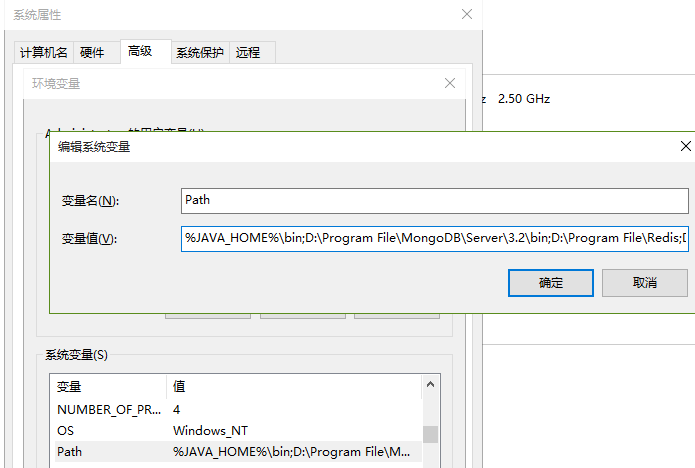

# JavaSE大纲

* java基础的语法
* oo思想,oop,ooad
* java的高级API[io流,集合框架,反射,注解,多线程等]

# 计算机编程语言

人和计算机进行交互

#### 交互模式

1. CLI - Command Line Interface - 命令行方式 - "需要使用大量的DOS命令,操作比较繁琐"
2. GUI - Graphical User Interface - 图形化用户方式 - "傻瓜式操作",基于鼠标的操作.

#### 常见的DOS命令

 dos - disk operating system - 磁盘操作系统

1. 进入某个盘符,比如进入E

   ~~~
   C:\Users\Administrator>e:
   ~~~

   

2. 创建目录,比如创建目录[文件夹]名称是tmp

   ~~~
   E:>md tmp
   ~~~

3. 查看当前目录或者磁盘下的所有的第一层的内容

   查看E盘下的直接第一层目录

   ~~~
   E:>dir
   ~~~

4. 方向键的上和下,可以记忆输入过的命令.

5. 进入到某个目录中,比如进入到tmp中

   cd - change directory - 改变目录

   ~~~
   E:>cd tmp
   ~~~

6. 只有一个.代表当前目录

7. 两个点代表上一级目录

8. 返回到当前的根目录

9. 创建文件File

   在tmp目录中创建文件hello.txt

   ~~~
   E:\tmp>cd.>hello.txt
   ~~~

10. 删除目录

    10-1. `空的目录`是允许直接被删除的,rd 目录名

    ~~~
    E:\tmp\tt>rd oo
    ~~~

    10-2. 删除非空目录,强制删除[一般是不允许使用的].

    ​	rd /s/q 目录名

    ~~~
    E:\tmp>rd /s/q tt
    ~~~

11. 查看所有的DOS命令.

    ~~~
    任意盘符:>help
    ~~~

12. 查看某个命令的具体使用方式

    ~~~
    help rd
    ~~~

13. 删除文件

    ~~~
    E:\tmp>del hello.txt
    ~~~

# Java介绍

* java之父 - 詹姆斯 高斯林 - James Gosling
* java语言原先是属于SUN公司 - 2010年被oracle公司收购了.
* java语言的前身是oak-机顶盒之类的产品
* java取名 - 印度尼西亚 爪哇岛 [很多咖啡树,咖啡豆]
* 正式出身1995年5月23日.
* java适合进行企业级开发 - JavaEE

#### Java的三大体系

* javase - java standard editional - java标准版 - 适合进行开发c/s架构的.桌面

  主要是学javase里面的语法和思想.

* javaee - java enterprise editional - java企业版 - 它不是一门具体的技术,而是一套技术的规范.

  [包含servlet,jquery,ajax,xml....框架...]

* javame - java micro editonal - java微型版 - "夭折了" - 手机应用程序.

#### java的语言的特点

* 简单的
* 跨平台性,与平台无关性,可移植性.[一次编译,到处运行]

* 属于解释型的语言
* 属于面向对象的[慢慢体会的],"万物皆对象".
* 安全性

#### 编译型和解释型的区别

记住:是否由计算机直接进行解释的.

1. 编译型的 - C语言[一次编程,到处运行] - 将C写的程序直接编译计算机[跟操作系统是有关系的]能够识别的二进制文件.

      - "中文的字典" [源码]- 一次性翻译成"英语"给美国人看.
   - "中文的字典" [源码]- 一次性翻译成"日文"给小鬼子看.

2. 解释型的 - java语言 - "中文的字典" - 用到的时候再进行解释.

   ​		配置了一个翻译官[不同国家需要不同的翻译,不同的操作系统的翻译是不一样的].

# 环境的搭建

jdk jre jvm

下载地址:www.oracle.com

jdk8.0下载:https://www.oracle.com/technetwork/java/javase/downloads/java-archive-javase8-2177648.html

#### JDK

java Development Kit - java开发工具 - 针对开发者的.

版本的变迁 - jdk1.0[夭折了] jdk1.1 - jdk1.2 - jdk1.3 - jdk1.4 - jdk5.0[巨变] - jdk6.0 - jdk7.0 - jdk8.0[这个] -....-jdk12.0.

## 三者之间的联系

 

* JDK包含JRE包含JVM

* JRE - Java Runtime Enviroment - Java运行时环境 - 针对"用户" - 使用java语言开发的程序的群体.

* JDK - Java Development Kit - Java开发工具包 - 针对"开发者" - 比如javac[编译] java[运行] javadoc[生成api文档] jar[用来打包的]

* JVM - Java Virtual Machine - Java虚拟机,正式由于有了jvm,那么java才能够跨平台.

  ​	 JVM是不跨平台的.[每个操作系统拥有不同的JVM]

### java程序运行的原理

.java为后缀的文件叫做java的源文件.

.class为后缀的文件叫做java的字节码文件.

.java源文件 -> 经过jdk中的编译器 -> 编译成了.class字节码文件 -> 交给jvm来进行逐行解释的 - > 解释成底层的操作系统能够识别的二进制数据.

 

### 配置JDK - 环境变量的配置

1. 在没有进行环境变量配置之前,通过cmd进入控制台之后输入javac命令的时候,会出现

   ~~~
   C:\Users\Administrator>javac
   'javac' 不是内部或外部命令，也不是可运行的程序
   或批处理文件。
   ~~~

   原因是:因为当前目录中不存在javac.exe文件.

   应该要进入到javac.exe所在的目录,D:\Program Files\Java\jdk1.8.0_66\bin,执行javac命令才能够生效.

2. 测试:输入notepad

   ~~~
   C:\Users\Administrator>notepad
   ~~~

   观察:实际上当前目录中并不存在notepad.exe,但是居然是有效的.

3. windows操作系统执行目录的规则是什么?

   * 第一步:优先到当前目录中寻找是否存在该命令.如果存在,执行

     如果不存在,则继续搜寻环境变量配置中的path中的路径.

#### 具体的配置

右击计算机 - 属性 - 高级系统配置 - 环境变量 - 高级 - 系统变量.

* 新建 变量名:JAVA_HOME

  ​         变量值:D:\Program Files\Java\jdk1.8.0_66

   

* 编辑 path - 推荐在最左边,添加

  %JAVA_HOME%\bin;

   

最后重启控制台,输入[查看jdk的版本的]

~~~
java -version
~~~

# Java编程初体验

#### Java标识符的命名规范

java的基本单位 - "类"

标识符 - 给java的类,变量,方法取的名字.

#### 关于"类"的命名规范

* 推荐使用"驼峰命名法则" - 首字母大写,其余单词的每个首字母也要大写,其他字母一律采用小写.

  HelloWorld    StudentManageSystem

* 类名是由字母,数字,下划线或者$符号组成.**但是不能以数字开头.**

  合理的:Student_System_123$     Teacher_Version02

  不合理的:123_Student

* 不建议使用中文[以后的web项目的编码方式都是utf-8],如果出现中文,容易造成乱码问题.

* 类名不推荐使用java的内置对象的名称.比如:System,String....

* 类名不能使用java的关键字[已经被这门语言赋予了一定的意义的单词].

  比如:public void main static final int double float if while for continue break finally try  catch class

* 类名不能是java的保留关键字goto const
* 类名不能是以下三个字面量 - null true false

* 提倡见名知意 - 为了提高代码的可读性[一种就是通过命名,通过注释(不能少于代码的1/3)]
* 类名和文件名高度保持一致

#### 关于"注释"

作用:提高代码的可读性,解释代码的作用,不会经过jdk中的编译器进行编译.

1. 单行注释 - 通常用来解释{}中的某行代码的意义

   ~~~java
   //单行注释1
   //单行注释2
   //单行注释3
   ~~~

2. 多行注释 - 同上

   ~~~java
   /*
    * 解释1
    * 解释2
    * 解释3
    */
   ~~~

3. 文档注释 - 通过javadoc命令来生成文档树

   通常是加在类或者方法上的.注释类和方法的.

   ~~~java
   /**
    * 本类用来演示: Java程序
    * @since version1.0
    * @author 作者
    * @date 日期
    * @version 1.0
    * @see 另参见
    */
   ~~~

#### java体验

~~~java
/**
* 本来用来演示:HelloWorld
* @author success
* @date 2019/3/25
*/
public class HelloWorld{//使用class关键字来定义一个类,HelloWorld就是类的名称
	//定义一个方法 - main
	//大家暂时死记住
	//main方法是程序的主入口
	//一旦运行程序,将会直接进入到main方法,进入到方法体中去执行里面的程序
	public static void main(String[] args){
		//在控制台中输出一句话
		System.out.println("学java,我很快乐!");
	}
}
~~~

进入到控制台

前提:进入到HelloWorld.java所在的那一层目录

~~~
javac HelloWorld.java
java HelloWorld
~~~

### 包的概念

包是用来管理类的,包之于类的作用,就相当于文件夹对文件的作用.

通过package关键字来声明一个包的

**命名规范:**

* 一般采用公司的域名倒置 + 项目代号的写法,公司的域名是唯一性的

  比如:com.baidu.day01   tech.aistar.day01 ...

* 包名全部采用小写字母组成,并且每个目录之间用.隔开
* 包不要使用java开头或者javax开头.

在temp目录中新建一个src和bin俩个目录

src - 存放源代码的  - 结构 - tech/aistar/day01

bin - 存放字节码文件的 - 结构是通过命令自动生成的.

 

- -d - 作用就是将生成的.class文件保存到../bin目录中
- -cp - 拼全 -classpath - 加载的java的程序的位置[找.class文件]

#### 类的全称

~~~java
package tech.aistar.day01;
public class Test{
    
}

package tech.aistar.day02;
public class Test{
    
    
}

//此处的Test仅仅是类的简称
//类的全称 - 类的全限定名 - 包名 + 类名 - 包名.类名
//Test的全限定名应该是tech.aistar.day01.Test
~~~

# IntelliJ IDEA使用

* 集成本地安装的jdk

   

* 统一编码

  File - Settings - 修改工程编码为UTF-8

  

   

* 修改主题

   

* 修改快捷键

   

* 修改字体大小

   

### 关于换行

print和println()

#### 关于\r和\n

* \n - 输出完毕之后,再换行,光标是停在下一行的起始位置
* \r - 输出完毕之后,回车,光标是停在当前行的起始位置

# 总结

1. JRE JVM JDK 三者之间的联系和区别
2. Java程序由编写 - 编译 - 解释 - 运行的一个执行原理
3. 包的声明package

4. 理解下System.out.println()和System.out.print()
5. idea中的一些快键键

### 提前预习

1. 二进制 八进制 十六进制 - 之间的换算
2. java中的基本的数据类型有哪些?
3. java中的变量的定义和使用?