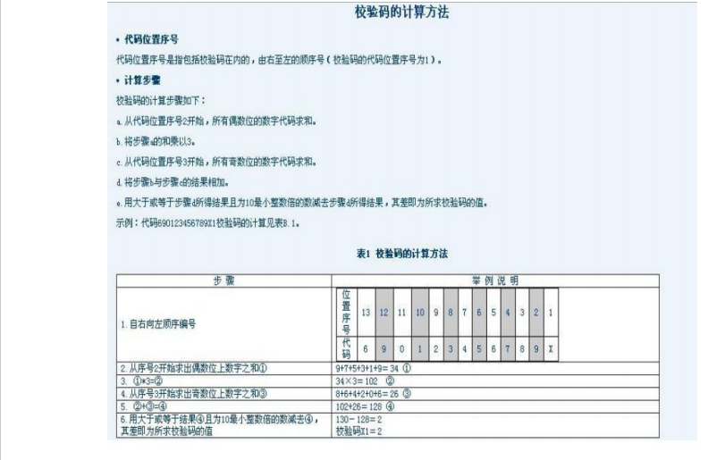

# 字符串处理类

Java中提供了三种处理字符串的类

* java.lang.String - 使用final修饰的,字符串是属于**不改变**的对象.本身就不会存在**线程问题**

* java.lang.StringBuilder - **可变**的,属于**线程不安全**,**效率**比较高

* java.lang.StringBuffer - **可变**的,属于**线程安全,****效率**比较低

  StringBuilder和StringBuffer使用方式几乎一样.在开发中,难得会将字符串置于一个线程不安全的状态.

  考虑到性能问题的话,优先使用StringBuilder.

## 线程安全和不安全的问题

~~~java
package tech.aistar.day13;

public class ThreadStringBuilderAndStringBuffer {
    public static void main(String[] args) {
        //线程不安全的,效率是高的
        StringBuilder builder = new StringBuilder();

        //线程安全的,效率是低的
        StringBuffer buffer = new StringBuffer();

        //模拟多线程环境分 - 模拟1000个线程.
         for(int i = 0;i<1000;i++){
             new Thread(new Runnable() {
                 @Override
                 public void run() {

                     for (int j = 0; j < 1000; j++) {
                         builder.append("1");
                         buffer.append("1");
                     }
                     //998569-1000000
                     System.out.println(builder.length()+"-"+buffer.length());
                 }
            }).start();
        }
    }

    //禁止这样写 - 静态成员是属于类拥有的,是对象共享的.
    private static StringBuilder builder = new StringBuilder();

    public void test(){
        StringBuilder builder = new StringBuilder();
    }
}
~~~

## 效率问题

java.lang.String是采用+来拼接字符串 - **效率极其低下** - 因为String本身是**不可变对象** - 每次用+拼接的时候,**都会产生一个新的对象.**

java.lang.StringBuilder和StringBuffer都是采用append方法来拼接的.这两者都是属于可变的对象,所以在调用append方法的时候,都是对原来的对象进行改变.拼接的过程中**不会产生新的对象.**

~~~java
package tech.aistar.day13;

public class AppendEfficiencyDemo {
    public static void main(String[] args) {
        testStringBuilder();
        testStringBuffer();
        testString();
    }

    public static void testString(){
        String str = "";

        //利用时间毫秒数
        long time = System.currentTimeMillis();//new Date().getTime()

        for (int i = 0; i < 1000000; i++) {
            str+=i;
        }
        long t = System.currentTimeMillis() - time;
        System.out.println("String->"+t+"ms");
    }

    public static void testStringBuilder(){
        StringBuilder str = new StringBuilder();

        //利用时间毫秒数
        long time = System.currentTimeMillis();//new Date().getTime()

        for (int i = 0; i < 1000000; i++) {
            str.append(i);
        }
        long t = System.currentTimeMillis() - time;
        System.out.println("StringBuilder->"+t+"ms");
    }

    public static void testStringBuffer(){
        StringBuffer str = new StringBuffer();

        //利用时间毫秒数
        long time = System.currentTimeMillis();//new Date().getTime()

        for (int i = 0; i < 1000000; i++) {
            str.append(i);
        }
        long t = System.currentTimeMillis() - time;
        System.out.println("StringBuffer->"+t+"ms");
    }
}
~~~

# java.lang.String

创建字符串的方式有两种:

* 通过**串池的方式**进行构建 - 效率高一点

  ~~~java
  String str = "hello";
  ~~~

* 通过构造的方式

  ~~~java
  String str = new String("hello");
  ~~~

## 创建方式的原理

JDK5.0时代的时候,串池是在方法区中.

JDK7.0时代的时候,串池被放入到堆中.

JVM内存结构 - 栈,堆,方法区.

* 串池 - 创建效率高 - 节省内存空间的一种方式

  ~~~java
  //每次利用串池的方式来构建字符串的时候,都会优先到串池中去寻找是否存在"a"这个字符串对象
  //发现没有,则会在串池中申请一块空间来存储"a".
  String str1 = "a";
  //发现存在,则直接将串池中的"a"引用过来,并没有再创建一个新的对象.
  //str2和str1都是指向串池中的"a"对象
  String str2 = "a";
  System.out.println(str1 == str2);//true
  ~~~

* 构造的方式

  ~~~java
  //只要出现new,就会在堆中开辟区域,创建新的对象.
  String str1 = new String("hello");
  String str2 = new String("hello");
  System.out.println(str1 == str2);//false
  ~~~

## 面试题

* String str = new String("abc");//此处构建了几个对象? - 1个或者2个

  优先到串池中去寻找是否存在"abc"这个对象.如果不存在.则在串池中创建一个"abc"对象.同时,也会通过new

  关键字在堆空间中开辟一块区域,用来保存"abc"对象.

* String str = new String("a"+"b"+"c");//创建了几个对象?假设串池中是空的.

  ~~~java
  "a" "b" "c" "ab" "abc" str
  ~~~

* 关于字符串的比较

  ~~~java
  String s1 = "a";
  //默认情况下,s2指向的是堆中的"a"
  String s2 = new String("a");//由于串池中已经存在了"a",仅仅创建了一个对象
  
  //获取串池中的字符串对象,s2指向的是池中的"a"对象
  System.out.println(s1 == s2.intern());//true
  System.out.println(s1 == s2);//false
  
  //+在进行拼接的时候会产生新的对象
  //        String s3 = "a";
  //        String s4 = "b";
  //        String result = s3 + s4;//通过字符串变量拼接的 - > 产生新的对象 -> 肯定不在串池中 -> 堆里面
  //        System.out.println("ab" == result);//false
  
  final String s3 = "a";
  final String s4 = "b";
  String result = s3 + s4;//由于s3和s4是不可变的,拼接的结果也是不可变的 -> 扔在"串池"中去了.
  System.out.println("ab" == result);//true
  
  String s5 = "a"+"b";//因为此处的"a"和"b"是一个精准的常量.所以"a"+"b"虽然得到的是一个新的对象"ab",但是"ab"肯定也是确定的
  //肯定也是在串池中.
  System.out.println("ab" == s5);//true
  
  System.out.println("ab" == new StringDemo().getString());//true
  
  public String getString(){
      return "a"+"b";
  }
  ~~~

## String常用构造

* String()
* String(byte[] byte) - 利用字节数组来构建一个字符串- byte[]转换成String类型
* String(String str) 
* String(StringBuilder builder) - StringBuilder类型转换成String类型
* String(StringBuffer buffer) - StringBuffer类型转换成String类型

## Sting类型中常用方法

* char charAt(int index);//返回指定索引出的字符.字符串的索引下标是从0开始,到字符串长度-1结束

  如果字符串下标越界,同样会抛出java.lang.StringIndexOutOfBoundsException

* int compareTo(String str);//按照字典顺序来比较俩个字符串.返回-1 0 1

* String concat(String str);//在原字符串末尾进行拼接,但是拼接完之后,返回的是一个新的字符串.

* boolean contains(CharSequence charsequence);//判断字符串是否某个字符序列

* boolean endsWith(String suffix);//判断字符串是否以suffix结尾的.

* boolean startsWith(String preffix);判断字符串是否以preffix开始的.

* static String format(String format,Object... args);//按照模板来格式化对象,返回一个字符串.

* boolean equalsIgnoreCase(String anotherstr);//忽略字符串的大小写的比较

* boolean equals(String str);//字符串的比较

* byte[] getBytes();//将字符串转换成字节数组

* indexOf相关的方法.

* boolean isEmpty();//判断字符串长度是否为0 

* lastIndexOf相关的方法

* int length();//返回字符串的长度

* **boolean matches(String regex);//用来判断给定的字符串是否符合正则的规则.**

* String replace(String oldStr,String newStr);//替换字符串,返回的是一个新的字符串.

* **String[] split[String regex);//用来根据regex的规则来切割字符串.**

* **String subString(int index);//从index处 - 字符串末尾对字符串进行截取,返回一个新的字符串**

  String subString(int start,int end);//截取并返回的是从下标[start,end)处的字符串 - 新的字符串

* **char[] toCharAarray();**//将字符串转换成字符数组

* String toLowerCase();//转换成小写

  String toUpperCase();//转换成大写

* String trim();//去除字符串两端的空格
* static String valueOf(类型 变量);//将其他类型转换成String类型.

## 转换问题

String类型和StringBuilder和StringBuffer三者之间的相互转换

String类型和Integer类型和int类型 - String类型和包装类型和基本类型之间的转换.

## JDK8.0中关于字符串的拼接的新的特性

* java.lang.String中提供了新的方法

  static String join(CharSequence char,CharSequence... str);

  join方法的底层实际上是使用了java.lang.StringJoiner的add方法

* static String join(CharSequence char, Iterable<? extends CharSequence> elements)

### StringJoiner

* 构造 - `StringJoiner(CharSequence delimiter)`;

  ​        - StringJoiner(CharSequence delimter,String prefix,String sufix);

* 方法 - StringJoiner add(CharSequence char); - 底层仍然是使用StringBuilder的append方法

# java.lang.StringBuilder

~~~java
 public static void main(String[] args) {
        //1. 利用字符串对象来构建一个StringBuilder对象
        //String类型 - >StringBuilder类型
        StringBuilder builder = new StringBuilder("abc");

        //2. 初始容量的概念 - 默认大小是16
        System.out.println(builder.capacity());

        System.out.println(builder.length());//长度

        //可变的对象 - 增append  删delete  改replace
        StringBuilder sb = new StringBuilder("acdvb");
        //根据指定下标来进行删除
        StringBuilder bd = sb.deleteCharAt(2);
        System.out.println(bd);//acvb
        System.out.println(sb);//acvb
        System.out.println(bd == sb);//true

        //删除指定区间的[start,end)
        System.out.println(sb.delete(1,3));//ab

        //在指定位置处插入序列
        System.out.println(sb.insert(1,"cdv"));//acdvb

        //替换
        System.out.println(sb.replace(1,3,"我们"));//a我们vb

        System.out.println(sb.reverse());//bv们我a

        System.out.println(sb);

        //将StringBuilder - > String
        String str = sb.toString();
        System.out.println(str);
    }
~~~

总结StringBuilder和String类型之间的相互转换

* StringBuilder - > String
  * String(StringBuilder builder)
  * java.lang.String类中static String valueOf(Object obj);
  * java.lang.StringBuilder类中提供的String toString();

* String - > StringBuilder
  * StringBuilder(String str)

# 包装类型

八种基本数据类型都有对应的包装类型.

包装类型就是基本类型的对象表现形式,默认值都是null.

* **java.lang.Integer**
* **java.lang.Double**
* java.lang.Character
* **java.lang.Byte**
* **java.lang.Short**
* **java.lang.Long**
* java.lang.Boolean
* **java.lang.Float**

## java.lang.Number

每个**数字类型**对应的包装类型都有一个顶级的抽象的父类 - java.lang.Number

## java.lang.Integer

### 构造方法

* Integer(String str);//将**数字形式的字符串**转换成了Integer

   如果传入了一个非数字形式的字符,就会抛出**java.lang.NumberFormatException**: For input string: "a"

* Integer(int i);//将int类型转成了Integer

### 自动解封箱

JDK5.0以后提供了自动解封箱的功能.

封箱:基本类型 - > 包装类型

解箱:包装类型 - > 基本类型

### 基本类型和包装类型之间的比较

~~~java
Integer o1 = new integer(10);
int o2 = 10;//基本类型和包装类型比较的时候
System.out.println(o1 == o2);//包装类型会自动转换成基本类型之后再进行比较 true
~~~

### 常用方法

* int intValue();//Integer - > int类型

* static Integer valueOf(int i);//int -> Integer

  当传入的数字范围在[-128~127]之间,底层并没有创建新的对象,而是直接从缓存中获取的.

* static Integer valueOf(String s);//String - > Integer,此处的字符串仍然是一个数字形式的字符串.

* static int ParseInt(String str);//将字符串转成 -> int类型
* static String toBinaryString(int i);//转换成十进制
* static String toOctalString(int i);//转换成八进制
* static String toHexString(int i);//转换成十六进制
* String toString();//Integer - > String

### 字段

static int MAX_VALUE;//int类型范围的最大值2^31-1

static int MIN_VALUE;int类型的范围的最小值-2^31

### 总结

String - Integer - int三者之间转换的所有的方式.

# 作业

~~~java
1. 从指定字符串中删除指定的字符序列
   str = "abcdebcfsdes";
   delStr(str,"de") -> abcdbfss
   
2. 找出俩个字符序列中最长的公串
   st1 = "abcde";
   st2 = "deabc";
   公串 abc  de -> 最长的 abc
  
~~~

## 条形码

 

