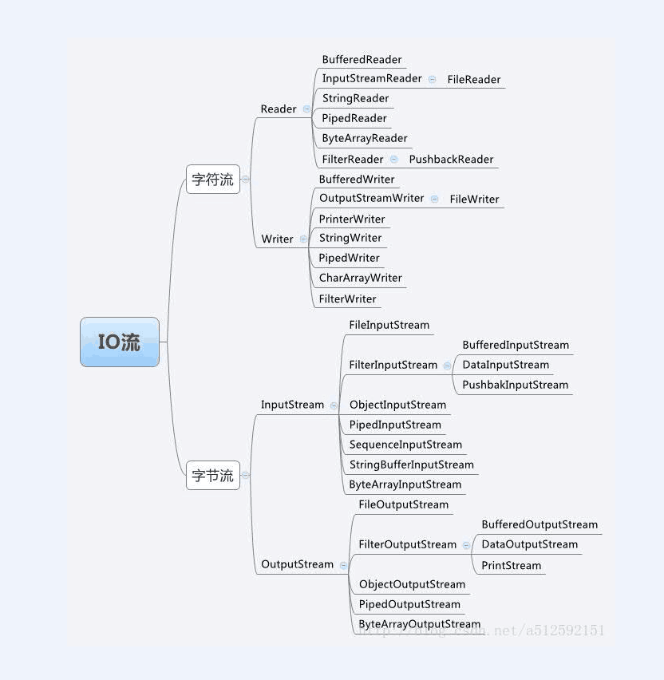

# 文件File

既可以获取本地,又可以获取远程的文件或者目录信息.

通过java.io.File类来将一个文件映射到Java内存中的File实例.

通过这个File类,我们可以进行文件或者目录本身的操作.

比如:创建文件,删除文件,创建目录,删除目录,获取文件或者目录的属性 - **文件或者目录本身的元信息.**

但是我们**不能通过这个类来实现对文件的读写操作** - 通过Stream[流]来实现的,此处的Stream的概念

和集合中的Stream是不同的概念.

## 构造

* File file(String pathname) - 参数可以是文件或者目录的绝对或者相对路径
  * 如果传入的是文件的绝对或者相对路径的话,那么构建出来的就是一个文件的File实例
  * 如果传入的是目录的绝对或者相对路径,那么构建出来就是一个目录的File实例

* File(File f,String name)

### 路径

* 绝对路径 - 以磁盘符或者\开头的
* 相对路径 - 非磁盘符或者\开头的路径

## 常用方法

* 关于创建的

  * boolean createNewFile() - 创建一个新的文件.

  * boolean mkdir() - 创建单层次的目录
  * boolean mkdirs() - 创建深层次的目录

* 关于获取文件或者目录的元信息

  * String getName();//获取文件或者目录的名称 - 注意:文件的名称是包含文件的后缀

  * long length();//获取文件的长度 - 应该是b

* 关于获取文件或者目录的路径的

  * String getParent();//获取文件或者目录的父目录的绝对路径
  * 绝对路径相关的:
    * String getAbsolutePath();

  * String getPath(); -  出来的是File()中的pathname

  * String toString(); - 出来的是File()中的pathname

* 关于判断的
  * boolean isFile();//判断构建出来的File实例是否是一个文件的实例.
  * boolean isDirectory();//判断构建出来的File实例是否是一个目录的实例.
  * boolean exists();//判断file实例是否存在.

* 删除方法

  * boolean delete();//删除文件或者目录

    注意点:文件的file实例是可以直接被删除的,空的目录也是可以直接被删除的,但是

    非空目录是不允许直接调用该方法进行删除的,导致删除失败.

* 目录的遍历
  * String[] list(FilenameFilter filter);//可以进行筛选后缀,前缀,包含等文件.
  * File[] listFiles();//遍历出当前目录的第一层的File实例[包含目录或者文件]
  * File[] listFiles(FilenameFilter filter);//过滤器

# IO流

流(Stream) - 是一组有顺序的,有起点和终点的字节的集合.流是数据传输的抽象或者总称,也就是说数据在设备

之间的传输,叫做流.并且根据传输的性质的不同,我们抽象出了各种处理流的类.方便操作不同的流.

通过Stream可以对本地的或者远程的文件(文本文件或者是二进制文件)进行真正地读写操作.

结构图:

## 流分类

* 按照流向分类

  * 输入流 - 外部 - JVM
  * 输出流 - JVM - 外部

  源头:文件    磁盘     键盘        网络

  目标:文件    磁盘     显示器    网络

* 按照流的功能

  * 字节流 - 读取的单位是字节,处理处理二进制数据[图片,视频] - 以字节为单位进行读取
  * 字符流 - 因为编码的出现,提供了字符流来高效处理字符文本[只能处理字符文本,不能处理二进制数据] - 以 字符为单位进行读取

  **字节流和字符流的区别?**

## 字节流

* **字节输入流**

  顶级的抽象的父类:java.io.InputStream

  * ByteArrayInputStream - 操作内存数组的字节输入流
  * **FileInputStream - 操作文件的字节输入流 [必须要掌握的]**
  * **ObjectInputStream - 操作对象类型的字节输入流[必须要掌握的]**
  * FilterInputStream - 过滤流
    * **BufferedInputStream - 带缓冲区[缓存]的字节输入流 - "装饰器模式"[必须要掌握的]**
    *  **DataInputStream - 操作基本类型的字节输入流[必须要掌握的]**

* **字节输出流**

  顶级的抽象的父类:java.io.OutputStream

  - ByteArrayOutputStream - 操作内存数组的字节输出流
  - **FileOutputStream - 操作文件的字节输出流 [必须要掌握的]**
  - **ObjectOutputStream - 操作对象类型的字节输出流[必须要掌握的]**
  - FilterOutputStream - 过滤流
    - **BufferedOutputStream - 带缓冲区[缓存]的字节输出流 - "装饰器模式"[必须要掌握的]**
    -  **DataOutputStream - 操作基本类型的字节输出流[必须要掌握的]**

### InputStream

* void close(); - 关闭流 - 流是一种昂贵的资源.用完之后,需要释放.
* abstract int read();//单个字节单个字节的进行读取 - 增加程序和磁盘的I/O交互 - 导致性能比较低下
* **int read(byte[] buf);//从输入流中读取一定的字节数放入到缓冲数组中.**

### OutputStream

* void close();//关闭输出流
* abstract void write(int b);
* **void write(byte[] buf,int off,int len)**
* void flush();//刷新缓存

### 具体步骤

任务:实现文件的拷贝操作.

* 选流 InputStream  FileInputStream  OutputStream FileOutputStream

* 确定源头和目标 - 源文件的路径和目标文件的路径

  ~~~java
  FileInputStream(String pathname);
  FileOutputStream(String pathname);
  ~~~

* 循环进行读取和写入

## 包装流

IO流框架的设计思想采用"装饰器"的设计模式.

将IO流分成两大类,第一类是基础流[节点流],第二类是拓展流[包装流].基础流提供了真正的具备读写能力.

拓展流[包装流]主要是用来功能的拓展,它并不具备真正的读写操作.**如果需要构建一个包装流**

**那么一定要以节点流作为支撑点.**

* 基础流[节点流] - 具备真正的读写能力

  FileInputStream/FileOutputStream 

  ByteArrayInputStream/ByteOutputStream

* 拓展流[包装流] - 不具备读写能力,仅仅是为了拓展

  ObjectInputStream/ObjectOutputStream - 操作对象类型的字节输入流/输出流

  DataInputStream/DataOutputStream - 操作基本类型的字节输入流/输出流

  BufferedInputStream/BufferedInputOutputStream - 带缓存功能的字节输入流/输出流

我们利用"装饰器"的设计模式,构建出功能更加强大的流

* 构建出一个带缓冲功能的文件的字节输入流

  ~~~java
  BufferedInputStream in = new BufferedInputStream(new FileInputStream("路径地址"));
  ~~~

* 构建出一个对象类型的文件的字节输入流

  ~~~java
  ObjectInputStream in = new ObjectInputStream(new FileInputStream("路径地址"));
  ~~~

* 构建出一个基本类型的文件的字节输入流

  ~~~java
  DataInputStream in = new DataInputStream(new FileInputStream("路径地址"));
  ~~~

* 构建出一个既带缓存功能,又支持对象类型的文件的字节输入流

  ~~~java
  ObjectInputStream in = new ObjectInputStream(
  						new BufferedInputStream(
                          	new FileInputStream("路径地址")   
                            )
  						);
  ~~~

# 作业

* 删除非空目录 - 递归
* 遍历目录 - 所有子目录[嵌套]
* 目录的拷贝

---

# 对象的序列化和反序列化

序列化的过程:将java内存中的对象写入到磁盘中

反序列化的过程:将磁盘[文件]中保存的java对象加载到内存,并且封装到对象中.

开发中:比如将java的某个集合写入到磁盘的pdf文件或者excel文件[poi第三方用来操作excel的jar文件]

## 注意点

如果没有实现该接口 - java.io.NotSerializableException

* 如果需要序列化一个对象的话,那么该对象必须要实现可序列化接口 - java.io.Serializable - 标记接口

* 如果序列化的这个对象中本身还关联了其他对象,那么关联的对象也要实现可序列化接口.

* 如果序列化的是一个集合或者数组对象 - 那么这个集合或者数组中的每个元素也要去实现序列化接口.

  **以后推荐大家写实体类的时候 - pojo或者entity包 - 统一都去实现可序列化接口.**

  以后推荐大家实体类的基本类型 - > 包装类型

  **尽量不要定义实体类的属性时候使用char类型.* - 推荐使用int类型来代替

## transient关键字

如果不希望持久化某个属性的话,那么可以在该属性前加上transient关键字.

~~~java
//不希望持久化author属性
private transient String author;
~~~

## 关于写入和读取

**一定是一次性写和一次性读的过程**

### 练习:

* 增加一条对象 - 集合中添加一个对象

  先读取 - list - list.add(newBook) - > 将list写入[覆盖]

* 根据id删除

  先读 - list - 根据id进行删除 - 将list写入

# DataInputStream

DataInputStream/DataOutputStream - 操作基本数据类型的字节输入流和字节输出流

应用:比如可以实现对象的id的一个自增长.

# Excel导入和导出

需要使用第三方的jar文件.使用的是POI - Apatche基金 - 免费提供的

# 字符流

处理的单位 - 字符读取

## 字符输入流

* java.io.Reader - 抽象的类
  - BufferedReader - 带缓存功能的字符输入流 - 并没有读的能力
  - InputStreamReader - 桥接器 - 获取键盘输入
    * FileReader - 读取字符文件 - 具备读的能力的

~~~java
BufferedReader in = new BufferedReader(new FileReader("路径"));
~~~

## 字符输出流

* java.io.Writer - 抽象的类
  * java.io.PrintWriter - 自带缓存功能 
  * java.io.FileWriter - 写入字符文件 - 具备写的能力的

### 构造方法

* PrintWriter(Writer out);

  ~~~java
  PrintWriter out = new PrintWriter(new FileWriter("路径"));
  ~~~

  

* PrintWriter(Writer out,boolean autoFlush);//如果autoFlush设置成true,自动刷新缓冲区,不需要手动调用flush方法

### 练习

实现文本文件的拷贝.

# 语法糖

~~~java
try(声明的资源1;声明的资源2){

}catch(...){

}
~~~

在try()中进行资源的声明,那么资源的关闭全部交给我们的jvm,不需要我们再去手动进行关闭了.

~~~java
  try(BufferedReader in = new BufferedReader(new FileReader(src));
            PrintWriter out = new PrintWriter(new FileWriter(target))){

        } catch (FileNotFoundException e) {
            e.printStackTrace();
        } catch (IOException e) {
            e.printStackTrace();
        }
~~~

# 字符编码

编码:字符 - 字节

解码:字节 - 字符

Java语言底层使用的unicode编码

* ascill码 - 一开始美国考虑到英文大小写以及一些符号和数字[0-2^7] - 128个字符

  西欧国家里面有超出ascill以外的一些字符,显然ascill不够用**.属于单字节**

* iso - 8859 - 1编码 - 对ascill码的拓展 - [128-255]**单字节** - "拓展字符集"

* gb2312[中文的简体] - gbk[中文的繁体和中文的简体] - 中国基于上面的标准,制定了本国的编码 - **中文是双字节**

* big5 - 台湾

* unicode[万维码,统一码] - 因为各个国家需要进行交流.**统一使用的是双字节**.并且不兼容 iso-8859-1

  涉及到数据在网络中的传输.

* **utf-8 - 字母,符号,数字采用单个字节,中文采用的是三个字节** 
* utf-16 - 四个字节

如果编码不统一,就很容易造成乱码

乱码问题:编码的方式和解码的方式采用的是不同的方式.

## 编码和解码

* byte[] getBytes(String charsetname);//字符-字节,按照传入的字符编码进行编码

*  String(byte[] byte,charset);//字节->字符,进行解码

  

# 桥接器

面试题:请你获取键盘输入,但是不允许使用Scanner

可以实现字节 - 字符

~~~java
 BufferedReader br = new BufferedReader(new InputStreamReader(System.in));
        System.out.println("请你输入:>");
        try {
            String line = br.readLine();
            System.out.println(line);
        } catch (IOException e) {
            e.printStackTrace();
        }finally {
            if(null!=br){
                try {
                    br.close();
                } catch (IOException e) {
                    e.printStackTrace();
                }
            }
        }
~~~

练习:实现程序员打字

~~~java
 try(InputStreamReader in = new InputStreamReader(new FileInputStream("src/tech/aistar/day15/charset/CharSetDemo.java"))){

            int len = -1;

            while((len = in.read())!=-1){
                System.out.print((char)len);
                Thread.sleep(50);
            }

        } catch (FileNotFoundException e) {
            e.printStackTrace();
        } catch (IOException e) {
            e.printStackTrace();
        } catch (InterruptedException e) {
            e.printStackTrace();
        }
~~~

# RandomAccessFile

随机访问流 - 读取大一点文件.

之前的流都是顺序从头到尾去读取.

应用:读取最后一行的记录

作用:可以进行光标的定位 - void seek(long pos) - 定位

