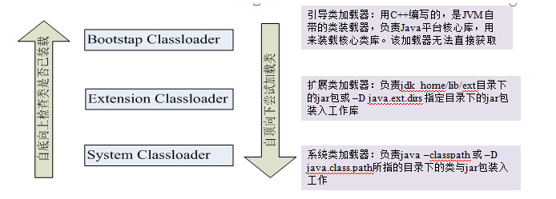
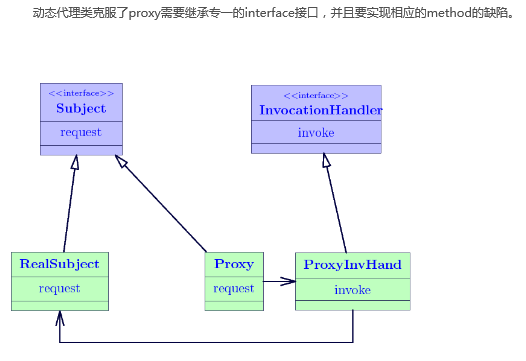

# 反射

框架的底层的实现是离不开反射机制的.

程序有编译期间[将程序翻译成机器语言的过程,比如.java->.class]和运行期间.

反射(reflection)又叫做内省.通过反射机制在程序**运行期间**能够动态获取类的内部信息以及

调用类的内部方法[所有方法]

作用:

* 动态获取属性名,属性的类型,属性的修饰符,属性的值,设置属性的值
* 动态获取方法的信息,方法的名称,方法的参数,方法的返回类型,方法的修饰符
* 动态调用方法.
* 获取构造方法的信息.
* 反射调用构造方法

## 补充一些概念

* 编译型语言和解释型语言区别
* 静态语言和动态语言的区别
* 静态类型语言和动态类型语言

# Class类

java.lang.Class<T>它是反射机制的基础类.当类加载器加载类的时候,**JVM会给每个加载的类在内存中创建出每个类**

**对应的class实例**.它在内存中永远只有1个.**即这个类是用来描述类的类.**

正常的类对于它的Class类而言,仅仅是它的对象而已.

 

## 获取class实例的5种方式

* Class.forName("类的全限定名");
* 类名.class
* 对象.getClass()
* 包装类型.class - 比如Integer.class
* 基本类型.class - 比如int.class

## 关于反射的API

* 关于Field - 属性

  * Field[] getFields(); //获取类中所有的公共的属性信息,返回的是一个Field组.

  * Field getFiled(String name);//根据属性名来获取该属性的Field实例. - 公共的public
  * **Field[] getDeclaredFields[];//返回所有的声明的字段[包括私有的字段]**
  * **Field getDeclaredField(String name);//根据属性名返回Field实例[包括私有的]**

* 关于class实例的名称
  * String getName();//获取类型的全限定名
  * String getSimpleName();//获取类型的简称

* 关于Method - 方法
  * Method[] getMethods();//获取类所有的公共的方法
  * Method getMethod(String name);/根据方法名来获取指定的方法的method对象[只能获取公共的]
  * Method[] getDeclaredMethods();//获取所有的方法[包括私有的]
  * Method getDeclaredMethod(String name,Class<?>... paramers);//获取公共的指定名称以及参数类型的方法的method实例

* 关于Constructor - 构造
  * Constructor<?>[] getDeclaredConstructors();
  * Constructor<?>[] getDeclaredConstructors(Class<?>... c);

* 关于数组
  * Class<?> getComponentType();//获取数组的组件类型

# 反射包

java.lang.reflect

## Field类

* int getModifiers();//返回用整数形式表示的修饰符

  public - 1  缺省 = 0  protected - 4  private - 2

* Class<?> getType();//获取属性的类型

* String getName();//获取属性的名称

* void set(Object obj,Obeject value);//将字段值设置到某个对象的属性上

* 父类中提供了

  void setAccessible(boolean flag);//只有设置成true,那么才能够对私有的属性进行设置值的操作

## Method类

* int getModifiers();//返回修饰符的整数的表现形式
* Object invoke(Object obj,Object... args);//方法的调用

## Constructor类

* 调用空参构造

  * 第一种方式 - 通过java.lang.reflect.Constructor下的newInstance方法

    ~~~java
    //获取空参构造的constructor对象
    Constructor<?> c1 = c.getDeclaredConstructor();
    
    //反射调用空参构造
    Point p1 = (Point) c1.newInstance();
    ~~~

  * 第二种方式:直接通过Class<T>中提供的newInstance方法

    ~~~java
    Class<?> c = Point.class;  
    Point p3 = (Point) c.newInstance();
    ~~~

    

* 调用带参构造

  ~~~java
  Constructor<?> c2 = c.getDeclaredConstructor(int.class,String.class);
  Point p2 = (Point) c2.newInstance(25,"tom");
  System.out.println(p2);
  ~~~

  

## Modifier

修饰符在底层是使用数字来表示的

* static toString(int mod) - 返回修饰符的字符串表现形式
* Class<?> getReturnType();//返回方法的返回类型
* String getName();//返回方法的名称
* Class<?>[] getParameterTypes();//返回方法的参数列表

# Spring中的应用

applicationContext.xml

~~~java
<!-- 实现类的实例化 -->
<bean id="helloWorld" class="com.spring.beans.HelloWorld">
	<!-- 依赖注入的三种方式 -->
    <!-- 1.属性注入-通过 setter 方法注入Bean 的属性值或依赖的对象
			   是实际应用中常用的注入方式 -->
    <!-- 对属性name进行赋值 -->
    <property name="name" value="spring"></property>

	<!-- 3.工厂方法注入（很少使用，不推荐） -->
</bean>
~~~

测试类

~~~java
ApplicationContext ctx = new ClassPathXmlApplicationContext("applicationContext.xml");
//2.从IOC容器中获取Bean实例
//利用id定位到IOC容器中的bean
HelloWorld helloWorld = (HelloWorld) ctx.getBean("helloWorld");
//调用hello方法
helloWorld.hello();
~~~

~~~java
public class HelloWorld {
	private String name;
	public HelloWorld() {
		System.out.println("HelloWorld的空参构造被调用了...");
	}
	
	public void setName(String name) {
		System.out.println("SetName:"+name);
		this.name = name;`
	}
	
	public void hello(){
		System.out.println("hello:"+name);
	}
}

~~~

# 反射操作数组

**问:Array和Arrays之间的区别?**

API:java.lang.reflect.Array - 通过反射数组的api来操作数组.

API2:java.util.Arrays - 数组工具类

****

## 常用方法

* static Object get(Object array,int index);//获取指定数组中的指定下标的值
* static Object newInstance(Class<?> componentType,int length);//反射创建数组
* static void set(Object arr,int index,Object val);//给数组设置值
* static int getLength();//获取数组的长度

## 数组的扩容

通过反射的方式来进行数组的扩容.

# 代理模式

本次课程中讲解的是JDK的代理模式[基于接口的实现].**根据代理类创建的时机,又分成静态代理和动态代理**.

模式类似于:房东 -> 中介 -> 房客;  明星 ->经纪人 -> 粉丝

房东:委托类

中介:代理类

房客:调用者

代理类的模式的出现是为了更好的符合代码的"**开闭**"原则.对内修改关闭,对外扩展开放.

## 静态代理

会自动生成代理的class文件,并且是在**编译期间**就会创建成功出这个代理类.

## 实例

~~~java
public interface IUserDao{
    
    void findAll();
    
    void update();
    
}

public class UserDaoImpl implements IUserDao{
    
    @Override
    public void findAll(){
       System.out.println("find...");
    }
    
    @Override
    public void update(){
        System.out.println("update...");
    }
}

//直接使用自己本身
IUserDao userDao = new UserDaoImpl();
userDao.findAll();
userDao.update();
~~~

软件升级:需要给dao接口中的每个方法增加日志功能 - **运行该业务方法之前和运行该方法之后.**

传统方式 - 不使用代理类的情况,直接修改UseDaoImpl

~~~java
public class UserDaoImpl implements IUserDao{
    
    @Override
    public void findAll(){
       //与业务逻辑无关的
       System.out.println("日志...方法之前执行");
       
        //业务逻辑代码
       System.out.println("find...");
        
       System.out.println("日志...方法之后执行");
        
    }
    
    @Override
    public void update(){
       //与业务逻辑无关的
       System.out.println("日志...方法之前执行");
        
       System.out.println("update...");
        
       System.out.println("日志...方法之后执行");
    }
}

~~~

弊端:

* 不符合"开闭"原则.
* 不符合代码的复用性.
* 不方便维护.
* 代码冗余 , 方法中尽有可能只出现与业务相关的代码

### 引入静态代理类

对原来的类UserDaoImpl.java不需要进行任何的改变.

UserDaoImpl.java - 委托类

UserDaoProxyImp.java - 代理类

**JDK代理[基于接口的形式]** - 俩者都要去实现共同的接口

~~~java
public interface IUserDao{
    
    void findAll();
    
    void update();
    
}

//委托类 - 被代理的类
public class UserDaoImpl implements IUserDao{
    
    @Override
    public void findAll(){
       System.out.println("find...");
    }
    
    @Override
    public void update(){
        System.out.println("update...");
}

//代理类 - 在编译期间生成代理类的.class文件.
public class UserDaoProxyImpl implements IUserDao{
    
    //维护一个委托类的对象
    private IUserDao userDao;
    
    public UserDaoProxyImpl(IUserDao userDao){
        this.userDao = userDao;
    }
    
    @Override
    public void findAll(){
       //与业务逻辑无关的
       System.out.println("日志...方法之前执行");
      
       userDao.findAll();
        
       System.out.println("日志...方法之后执行");
        
    }
    
    @Override
    public void update(){
       //与业务逻辑无关的
       System.out.println("日志...方法之前执行");
       
        userDao.update();
        
       System.out.println("日志...方法之后执行");
    }
}

//创建委托类的对象
IUserDao userDao = new UserDaoImpl();//房东
//创建代理类的对象
IUserDao userDaoProxy = new UserDaoProxyImpl(userDao);//中介

userDaoProxy.findAll();
userDaoProxy,update();

~~~

## 动态代理

在程序运行时，由反射机制动态创建而成。

  

java动态代理类位于java.lang.reflect包下，一般主要涉及到以下两个类：

- Interface InvocationHandler：该接口中仅定义了一个方法Object：invoke(Object obj,Method method, Object[] args)。在实际使用时，第一个参数obj一般是指代理 类，method是被代理的方法，如上例中的request()，args为该方法的参数数组。 这个抽 象方法在代理类中动态实现
- Proxy：该类即为动态代理类
- Protected Proxy(InvocationHandler h)：构造函数，估计用于给内部的h赋值。
- Static Class getProxyClass (ClassLoader loader, Class[] interfaces)：获得一个 代理类，其中loader是类装载器，interfaces是真实类所拥有的全部接口的数组。

