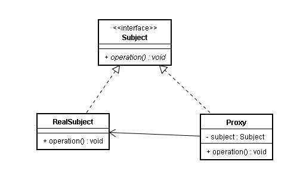

# 代理模式

代理模式是Java中常见的一种模式，英文名字叫走Proxy或者Surrogate，代理的本意是一个人代表另一个人，或者一个机构代表另一个机构，采取行动，因而，代理和现实生活中的中介有很大的类似，你买房子、卖房子，可以自己去操作，但是需要了解和买卖房产无关的细节，如契税等，而找一个中介，则不用关心这些与买卖房产无直接关系的中间细节，只关心业务本身。

 

**模式中包含的角色及其职责**

Subject：抽象主题角色，抽象主题类可以是抽象类，也可以是接口，是一个最普通的业务类型定义，无特殊要求.

RealSubject：具体主题角色，也叫被委托角色、被代理角色。是业务逻辑的具体执行者。

Proxy：代理主题角色，也叫委托类、代理类。它把所有抽象主题类定义的方法给具体主题角色实现，并且在具体 主题角色处理完毕前后做预处理和善后工作。（最简单的比如打印日志）.

**代理模式的适用**，总结为：代理类主要负责为委托类预处理消息、过滤消息、把消息转发给委托类，以及事后处理消息等

## 代理分类

按照代理创建的时期，可以分为动态代理和静态代理

### 静态代理

由程序员或者自动生成工具生成代理类，然后进行代理类的编译和运行。在代理类、委托类运行之前，代理类已经以.class的格式存在。

### 动态代理

在程序运行时，由反射机制动态创建而成。

 

java动态代理类位于java.lang.reflect包下，一般主要涉及到以下两个类：

* Interface InvocationHandler：该接口中仅定义了一个方法Object：invoke(Object obj,Method method, Object[] args)。在实际使用时，第一个参数obj一般是指代理 类，method是被代理的方法，如上例中的request()，args为该方法的参数数组。 这个抽 象方法在代理类中动态实现
* Proxy：该类即为动态代理类
* Protected Proxy(InvocationHandler h)：构造函数，估计用于给内部的h赋值。
* Static Class getProxyClass (ClassLoader loader, Class[] interfaces)：获得一个 代理类，其中loader是类装载器，interfaces是真实类所拥有的全部接口的数组。

# 总结

对于JDK 的Proxy,有以下几点：

* Interface：对于JDK proxy，业务类是需要一个Interface的，这也是一个缺陷

* Proxy，Proxy 类是动态产生的，这个类在调用Proxy.newProxyInstance(targetCls.getClassLoader, targetCls.getInterface,InvocationHander)之后，会产生一个Proxy类的实例。实际上这个Proxy类也是存在的，不仅仅是类的实例。这个Proxy类可以保存到硬盘上。

*  Method:对于业务委托类的每个方法，现在Proxy类里面都不用静态显示出来

*  InvocationHandler: 这个类在业务委托类执行时，会先调用invoke方法。invoke方法再执行相应的代理操作，可以实现对业务方法的再包装

