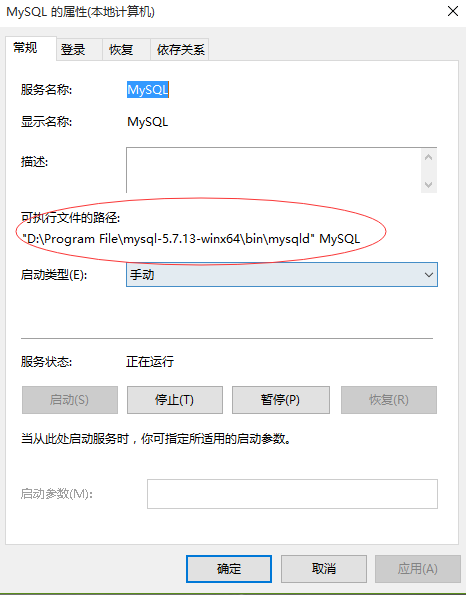
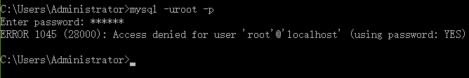
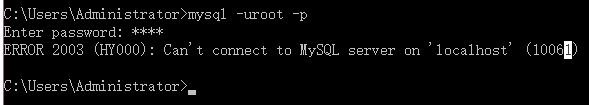
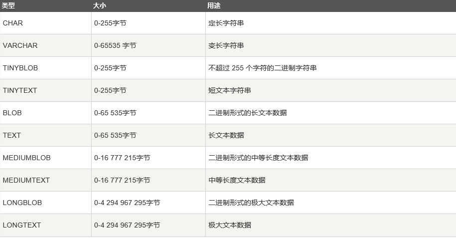
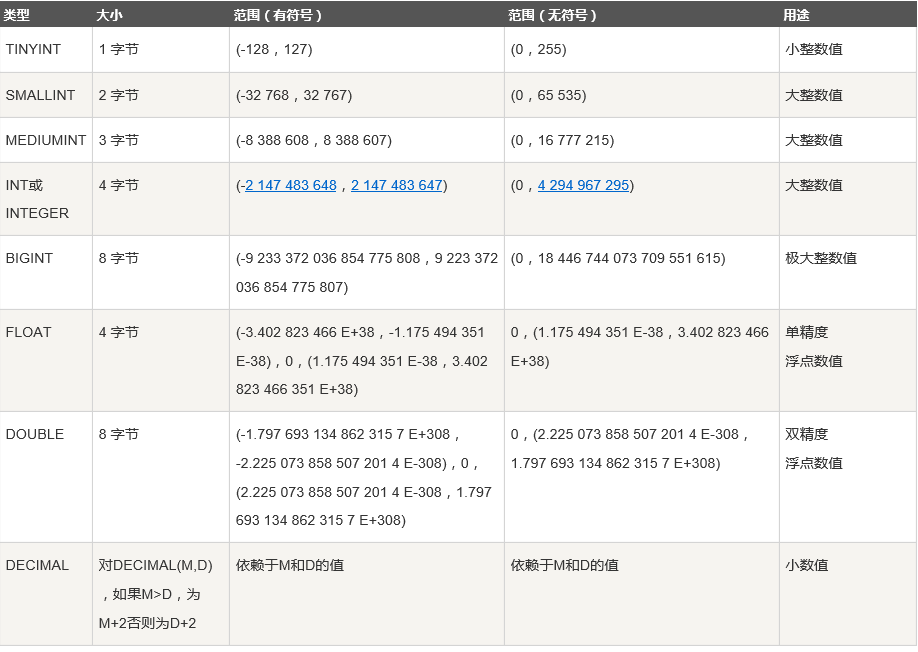
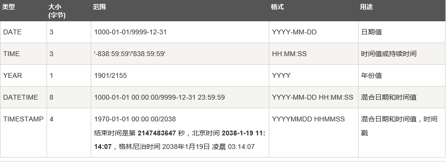
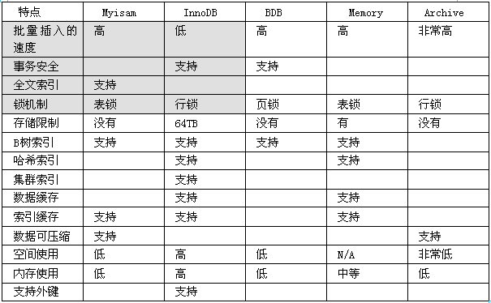
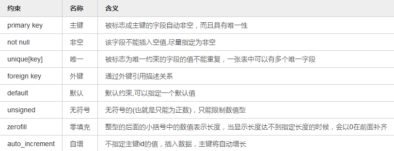

# Mysql安装

mysql4.x~mysql5.7.x

最新的mysql8.x版本

版本:社区版,企业版[收费],集群版[将多个mysql server整合到一个server],高级集群版[收费]

下载的官方的地址:https://dev.mysql.com/downloads/file/?id=484900

## 安装

* 进行环境变量的配置

  ~~~sql
  新建->
  变量名:MYSQL_HOME
  变量值:D:\Program File\mysql-5.7.13-winx64
  
  选中path->编辑
  %MYSQL_HOME%\bin;
  ~~~

* 在D:\Program File\mysql-5.7.13-winx64根目录中新建my.ini文件,添加如下内容:

  ~~~ini
  [mysql]
  # 设置mysql客户端默认字符集
  default-character-set=utf8
   
  [mysqld]
  # 设置3306端口
  port = 3306
  # 设置mysql的安装目录
  basedir=D:\Program File\mysql-5.7.13-winx64
  # 设置mysql数据库的数据的存放目录
  datadir=D:\Program File\mysql-5.7.13-winx64\data
  # 允许最大连接数
  max_connections=1000
  # 服务端使用的字符集默认为8比特编码的latin1字符集
  character-set-server=utf8
  # 创建新表时将使用的默认存储引擎
  default-storage-engine=INNODB
  ~~~

* 以**管理员**的身份,**进入到D:\Program File\mysql-5.7.13-winx64\bin目录中.**

  如果不是进入到该目录中执行如下命令,那么mysql服务的可执行文件地址默认在C盘.将**会导致mysql服务打不开.**

   

  

  ~~~sql
  mysqld install
  mysqld --initialize-insecure
  ~~~

  标注:-insecure - 初始化的时候,创建了一个默认的密码,密码为空.默认的账户名是root.

  如果执行:mysqld --initialize--console       

  会分配一个随机的密码.

* **启动mysql服务**

  第一种:通过命令来启动

  ~~~sql
  net start mysql
  net stop mysql
  ~~~

  第二种:通过GUI方式

  右击计算机 - 管理 - 服务和应用程序 - 服务 - 找到MYSQL服务.

* 登录

  ~~~sql
  mysql -u用户名 -p
  输入密码
  ~~~

  能登录成功,则说明安装成功.

## 卸载

* 以管理员身份进入到bin目录,无需登录mysql

  ~~~sql
  D:\Program File\mysql-5.7.13-winx64>mysqld remove
  D:\Program File\mysql-5.7.13-winx64>sc delete mysql
  ~~~

* 从注册表中进行删除

  输入regedit

  HKEY_LOCAL_MACHINE\SYSTEM\CurrentControlSet\Services\MySQL

  HKEY_LOCAL_MACHINE\SYSTEM\ControlSet001\Services\MySQL

  将上述俩个路径下的MySQL目录全部删除

* 重启计算机

### 连接失败

* 用户名和密码不正确

   

* MySql服务没有开启

   

## 修改密码

如果初始化使用的是:

~~~sql
mysqld --initialize--console
~~~

会自动分配一个默认的密码,然后利用root账户和分配的密码进行登录进去.

~~~sql
mysql -uroot -proot
use mysql;
update user set authentication_string = password('root') where user = 'root';
flush privileges;
~~~

# 数据库

什么是数据库?

DB - DataBase

按照一定的**数据结构和组织**来存储数据的仓库.早期,我们的数据是可以存放到普通文件中,但是存取效率比较低.

所以才去使用数据库来管理我们的数据.

## 数据库的模型

早期的有层次性模型,网络型的,关系型的.

**现在主流数据库模型的就是关系型和非关系型的**

* 关系型的典型的代表
  * Mysql - 属于Oracle公司的,开源的,免费的,中小型企业最受欢迎的
  * Oracle - 企业版也是收费的,19年收购了Mysql以及SUN公司.适合大型和超大型企业的.
  * SqlServer - MS自己的大型的数据库

* 非关系型数据的代表[NOSQL]:
  * mongodb - 介于关系型和非关系型之间的一套数据库
  * redis - 缓存数据库

## 术语

* DB - DataBase - 数据库

  作用:是用来存储数据的仓库.

  **Mysql数据库推荐使用仓库的方式来管理数据.**

  

* DBA - 数据库管理员

  工作性质:侧重于运维.主要是对数据库的日常的管理和维护.保证数据库在7*24小时

  ​		内能够高效文档的运转.侧重于维护和管理.

* DE - 在国外有的人将DBA说成是DE - 数据库工程师

  工作性质:侧重于数据库系统的研发工作[阿里已经对Mysql重构了.]

* RDBMS - 关系型数据库管理系统 - Relational DataBase Management System

  * 特点如下
    * 基本单位 - 以二维表的形式存在[表格]
    * 一行为一个记录的名称.
    * 列是每个记录对应的域.
    * 这么多行和列的数据组成了一张表
    * 多张表就组成了数据库

* DBMS - 数据库管理系统 - DataBase Management System

  * 作用
    * 为访问数据库提供了统一的方式
    * DBA可以通过DBMS来管理和维护DB
    * 普通用户可以通过DBMS来操作数据库[连接,CRUD操作].

* DBS - DataBase System - 数据库系统

  DBS = DBA + DBMS

### RDBMS术语

* 表(table) - 一张二维表 - 基本单位
* 行(row) - 记录,元组
* 列(column) - Field - 数据域
* 冗余 - 比如将相同的数据存储了2倍.允许一定的冗余,可以更加安全.
* 主键 - 作用:可以确定唯一一行.特点:唯一且非空
* 外键 - 表与表之间的关系是通过建立外键.
* 复合键 - 比如复合索引
* 参照完整性 - 外键是允许为空的,但是一旦引用的话,那么必须要有对应的记录存在.

# SQL分类

学习目标就是重点掌握SQL.关系型数据库都是通过sql语句来操作数据库的.

SQL - 结构化查询语言.市场上的关系型数据库的90%的sql都是一样的.

存放我们sql语句的文件的后缀.

* DCL - Data Control Language - 数据控制语言

  grant revoke

* DDL - Data Definiton Language - 数据定义语言

  **create drop alter** truncate *rename to*  comment

* DML - Data Manipulating Language - 数据操纵语言

  **insert update delete**

* DQL - Data Query Language - 数据查询语言

  **select**

* DTL - Data Transaction Lanauage - 数据事务语言

  commit rollback savepoint

# 常见的DB - Client命令

安装Mysql数据库的时候,会帮我们在计算机中安装好mysql服务器端和mysql客户端[是通过cmd进行入的]

无论是命令还是SQL的结束符都是用分号.

* SHOW DATABASES; //展示所有的数据库
* USE 仓库名;//使用仓库
* SHOW TABLES;//查看某个仓库下所有的表,前提必须要显示USE 仓库名
* DESC 表名;//查看表的结构
* SHOW CREATE TABLE 表名;//查看建表语句
* SHOW COLUMNS FROM 表名;//查看表的结构 - 列的信息 - 列名,约束,类型等信息

# 创建数据库

创建自己的数据库

~~~sql
CREATE DATABASE 数据库名;
~~~

使用数据库

~~~sql
USE 数据库名;
~~~

查看数据库的编码 - 统一编码是UTF-8

~~~sql
SHOW VARIABLES LIKE '%character_set_%';
~~~

删除数据库

~~~sql
DROP DATABASE 数据库名;
~~~

# 数据库设计

立项 - 需求分析[数据库设计] - 概要设计 - 详细设计 - 编码 - 测试 - 交付 - 维护.

抽取出业务中的关键的对象.因为这些对象都是需要进行持久化操作的.是需要将对象的属性数据

保存到表[table]中.

## ORM思想

ORM - Object - Relation - Mapping - 对象关系映射.

| O - 对象   | R - 表                                                  |
| ---------- | ------------------------------------------------------- |
| 类名       | 表名                                                    |
| 属性名     | 列名                                                    |
| 标识符id   | 主键列 - 唯一确定一行的列,非空且唯一,每张表都应该需要的 |
| 对象的关系 | 外键 - 通过foreign key来维护表与表之间的关系的          |

比如:

| Student类 | TBL_STUDENT |
| --------- | ----------- |
| id        | id          |
| name      | name        |

## 数据库的设计工具

使用工具创建E-R图 - Entity - Relation图

* Power Design - 比较经典的
* JUDE - 日本的

## 数据库表的设计规范

表的设计至少要满足三大范式

* 1NF - 第一范式

  保证列的原子性 - 列应该是不可再分割的.

  | id   | first_name | last_name |
  | ---- | ---------- | --------- |
  | 1    | Carmen     | James     |

  name属性列还可以继续拆分成first_name和last_name

  | id   | address          |      |      |
  | ---- | ---------------- | ---- | ---- |
  | 1    | 江苏省苏州市园区 |      |      |

​	但是业务中总是需要对address三个部分中的其中一个部分进行频繁的查询:

​	select * from xx where address like '%苏州市%';

​	模糊查询的效率比较低下 - 全表扫描.

​	需要对address再拆分

| id   | province | city   | area |
| ---- | -------- | ------ | ---- |
| 1    | 江苏省   | 苏州市 | 新区 |

​	select * from xx where city = '苏州市';//可以在city建立索引.

* 2NF - 第二范式

  不存在非关键列部分依赖于关键列.

  关键列就是主键列[可以由1列或者多列组成(复合主键)].

  | sid  | sname | cid  | cname  | score |      |
  | ---- | ----- | ---- | ------ | ----- | ---- |
  | 1    | tom   | 1    | java   | 100   |      |
  | 2    | jack  | 1    | java   | 90    |      |
  | 2    | tom   | 2    | python | 59    |      |

  确认主键列[关键列] - 能唯一确定这一行 - (sid,cid)

  **上述的这种设计存在非关键列部分依赖于关键列**

  (sid,cid) - > cname    (sid,cid)->sname

  

  进行拆分:

  tbl_student表

  | sid  | sname |
  | ---- | ----- |
  | 1    | tom   |
  | 2    | jack  |

  tbl_course表

  | cid  | cname  |
  | ---- | ------ |
  | 1    | java   |
  | 2    | python |

  sc表

  | sid  | cid  | score |
  | ---- | ---- | ----- |
  | 1    | 1    | 100   |
  | 1    | 2    | 59    |
  | 2    | 1    | 90    |

* 3NF - 不存在非关键列传递依赖于关键列

  | husband_id | husband_name | wife_id | wife_name |
  | ---------- | ------------ | ------- | --------- |
  | 1          | 詹亮         | 1       | 凤姐      |
  | 2          | 张韬         | 2       | 苍老师    |

  精确找到主键列 - husband_id -> wife_id -> wife_name

  wife_name非关键列传递依赖于关键列husband_id

  | husband_id | husband_name |
  | ---------- | ------------ |
  | 1          | 詹亮         |
  | 2          | 张韬         |

  | wife_id | wife_name | husband_id |
  | ------- | --------- | ---------- |
  | 1       | 凤姐      | 1          |
  | 2       | 苍老师    | 2          |

  

## DDL - 建表

DDL - CREATE UPDATE INSERT TRAUNCATE COMMENT...

登录 - 使用数据库 - 操作

1. 列名以及列的数据类型 - 一定程度上可以保证插入数据的类型的安全.
2. 约束名以及约束类型.

语法:

~~~sql
CREATE TABLE [IF NOT EXISITS] 表名(
	列名1  列的数据类型(长度) [约束类型] [COMMENT][注释],
    列名1  列的数据类型(长度) [约束类型] [COMMENT][注释],
    ....
    ....
    列名N  列的数据类型(长度) [约束类型] [COMMENT][注释]
)ENGINE = INNODB DEFAULT CHARSET=UTF8;
~~~

## 列的数据类型

* 字符串类型

  

  

  **最常用的就是varchar类型** - 可变的

  * varchar - 可变的 - varchar(20)
  * char - 固定的字符 - char(3) - 尽量不要使用.
  * text - 长文本数据
  * blob - 二进制的形式的长文本数据 - 图片,视频

   

* 数字类型

  

  

  * 整数

    * 小数 int类型

      int(5) - > 这个列能够存储的最大的数字是99999

    * 小数 double或者float

      double(7,2) - 能够表达的最大的数值 - 99999.99

   

* 日期类型

   

  * date - 年月日
  * datetime - 年月日时分秒

### 对比java类型

因为最终是要将java的对象保存到数据库表中.每个属性对应每个列.

* Java中的char类型,String类型都是可以保存到DB中的varchar类型修饰的列.

* Java中的byte short int 保存到DB的int类型

  long对应BigInt类型

* Java中的Date类型就对应数据库表中的列的date类型和datetime类型.

**以后使用INSERT语句进行数据插入的时候,一定要注意插入的数据的类型要和列的定义的类型匹配,否则会报错.**

### 练习

~~~sql
use aistar;
create table t_user(
	id int(7),
    uname varchar(20),
    pwd varchar(20),
    birthday date
)Engine = InnoDB default charset=utf8;
~~~

~~~java

-- 如果数据库中不存在该表 - 则创建成功.否则并不报错.
create table if not exists t_user(
	id int(7),
    uname varchar(20),
    pwd varchar(20),
    birthday date
)Engine = InnoDB default charset=utf8;
~~~

## 存储引擎

定义:就是数据库中按照一定的机制来定义如何插入数据,如何建立索引,如何更新数据的.规定了DB如何进行存储数据.

 

* Myisam 

  * 数据量不是特别大,不适合高并发的场景.**并且不支持行级锁.**
     * **最大的缺陷是不支持事务.**
     * 不支持外键

* InnoDB - MYSQL5.7默认的存储引擎

     - 更新密集数据 - 支持高并发的场景 - **支持的是行级锁**

     - **支持事务 - 所有的存储引擎中唯一支持事务的.**

     - 支持灾难的自我修复 - 比如发生意外的时候,InnoDB存储引擎内部会自动去排查log日志文件.

       找到错误,进行自我修复,大部分的错误还是能够进行恢复的.

  * 支持外键 - 表与表之间的关系
  * 支持自增长的列 - auto_increment

* Memory - 数据存储在内存,一旦发生灾难.那么数据将不可恢复.

## 约束类型

为了插入的数据更加合法.

 

* **primary key和unique的区别**

  相同点:具备唯一性

  不同点:主键在一张表中只存在一个.但是唯一性的约束可以存在多个.

  ​	     主键不能为空,但是唯一性列的值是允许为空.

## 带有约束的建表语句

* 约束的列级添加 - 是不能指定约束的名称 - 使用比较少.

  注意点:自增长的列一定要放在primary key.

  ~~~sql
  drop table t_user;
  create table if not exists t_user(
  	id int(7) primary key auto_increment,
      uno varchar(20) unique not null,
      uname varchar(20) not null,
      pwd varchar(20) default '123',
      birthday datetime default now()
  )Engine = InnoDB default charset=utf8;
  
  
  mysql>insert into t_user(uno,uname,birthday) values('1001','admin','2018-04-23 14:49:24');
  mysql>select * from t_user;
  
  mysql>insert into t_user(uno,uname,birthday) values('1001','success','2018-04-23 14:49:24');
  
  ~~~

* 表级添加 - 推荐 - 可以给约束取名字 - 精确找到错误所在.

  表级添加不支持not null

  语法:constraint 约束名字 约束类型(列名)

  约束名命名规则:

  ~~~java
  表名_列名_约束的缩写
  primary key - pk
  not null - nn
  unique - uq
  ~~~

  ~~~sql
  drop table t_user;
  create table if not exists t_user(
  	id int(7) auto_increment,
      uno varchar(20) not null,
      uname varchar(20) not null,
      pwd varchar(20) default '123',
      birthday datetime default now(),
      constraint t_user_id_pk primary key(id),
      constraint t_user_uno_uq unique(uno)
  )Engine = InnoDB default charset=utf8 auto_increment = 4;
  ~~~

* 约束的第三种添加方式 - 使用alter命令来进行添加

  ~~~sql
  drop table tbl_user;
  create table if not exists tbl_user(
  	id int(7),
      uno varchar(20),
      uname varchar(20),
      pwd varchar(20) default '123',
      birthday datetime default now()
  )Engine = InnoDB default charset=utf8 auto_increment = 1;
  alter table tbl_user add constraint t_user_id_pk primary key(id);
  alter table tbl_user modify column uno varchar(20) not null;
  alter table tbl_user add constraint t_user_uno_uq unique(uno);
  ~~~

  

## alter命令

* 操作表和列

  * 修改表名 - alter table 表名 rename to 新名;

    ~~~sql
    mysql>alter table t_user rename to tbl_user;
    ~~~

  * 添加列 - alter table 表名 add column 列名 数据类型(长度) 约束类型;

    ~~~sql
    mysql>alter table tbl_user add column age int(7) default null;
    ~~~

  * 给列重新命名 - alter table 表名 change 旧列名 新列名 数据类型(长度)

    ~~~sql
    mysql>alter table tbl_user change column age ages int(7);
    ~~~

  * 修改列的属性- - alter table 表名 modify 列 新的属性;

    ~~~sql
    mysql>alter table tbl_user modify ages int(6);
    ~~~

  * 删除列 - alter table 表名 drop column 列名;

    ~~~sql
    mysql>alter table tbl_user drop column ages;
    ~~~

* 操作约束的

  * 添加非空约束 - alter table 表名 modify column 列名 类型 not null;
  * 添加普通约束 - alter table 表名 add constraint 约束名 约束类型(列名);
  * 根据约束名进行删除 - alter table 表名 drop key 约束名;
  * 删除主键约束 - alter table 表名 drop primary key;
  * 删除外键约束 - alter table 表名 drop foreign key 外键名;

  ~~~sql
  alter table tbl_user add constraint t_user_id_pk primary key(id);
  alter table tbl_user modify column uno varchar(20) not null;
  alter table tbl_user add constraint t_user_uno_uq unique(uno);
  ~~~

## 删除表

~~~sql
DROP TABLE 表名;
~~~

# 关于用户管理操作

* 创建用户
* 删除用户
* 授权

# 远程连接数据库

关闭系统的防火墙.

~~~sql
mysql -h 主机地址 -uroot -proot
~~~

授权:

~~~sql
mysql> grant all privileges  on *.* to root@'%' identified by "root";
Query OK, 0 rows affected, 1 warning (0.00 sec)

mysql> flush privileges;
Query OK, 0 rows affected (0.01 sec)
~~~

# 外键约束

表与表之间的关系是通过外键来建立的.但是在实际开发中,不推荐创建外键.

外键的存在会增加耦合.

* 外键列允许为空

* 外键列出现在多的一方.

  

## 表与表之间的关系

1:1 - 一个丈夫对应一个妻子

**1:N -** 一个客户拥有多个订单,多个订单只属于一个客户

N:N - 一个学生可以选择多门课程,一门课程可以被多个学生进行选择

​	- 一个用户可以拥有多个角色,一个角色可以被多个用户共享.

​	- 通常是拆分成俩个1:N

自关联 - 自己关联自己

### 一对一

实体类中关系具有方向性,单向关联和双向关联

~~~java
public class Husband{
    private int husband_id;
    
    private String husband_name;
    
    //一个丈夫拥有一个妻子
    private Wife wife;
    
    //现在记住:对象中是没有外键的概念的
    //private int wife_id;
}

public class wife{
    
    private int wife_id;
    
    private String wife_name;
    
    //推荐的是能用单向关联解决的业务 - 绝对不用双向关联
    //private Husband husband;
}
~~~

运用ORM - Object - Relation - Mapping

| husband_id | husband_name |
| ---------- | ------------ |
| 1          | 詹亮         |
| 2          | 张韬         |

| wife_id | wife_name | husband_id(外键列) |
| ------- | --------- | ------------------ |
| 1       | 凤姐      | 1                  |
| 2       | 苍老师    | 2                  |

或者:

| husband_id | husband_name | wife_id(外键列) |
| ---------- | ------------ | --------------- |
| 1          | 詹亮         | 1               |
| 2          | 张韬         | 2               |
| 3          | 管成功       | null            |

| wife_id | wife_name |
| ------- | --------- |
| 1       | 凤姐      |
| 2       | 苍老师    |

### 一对多

外键列是出现在多的一方

客户表:tbl_customer

| id   | cnam    |
| ---- | ------- |
| 1    | success |
| 2    | james   |
| 3    | jack    |

订单表:tbl_order表

| id   | orderno | price | cid[外键] |
| ---- | ------- | ----- | --------- |
| 1    | 1001    | 100.0 | 1         |
| 2    | 1002    | 200.0 | 1         |
| 3    | 1003    | 300.0 | 2         |
| 4    | 1004    | 400.0 | 3         |

对应的实体类:

~~~java
public class Customer{
    private int id;
    
    private String cname;
    
    //一个客户拥有多个订单
    private Set<Order> orders;
}

public class Order{
    private int id;
    
    private String ordno;
    
    private double price;
    
    //多个订单对应一个客户
    private Customer customer;
}
~~~

### 多对多

tbl_student表

| id   | sname   |
| ---- | ------- |
| 1    | jack    |
| 2    | tom     |
| 3    | gosling |
| 4    | success |

tbl_course表

| id   | cname  |
| ---- | ------ |
| 1    | java   |
| 2    | python |
| 3    | c      |
| 4    | c++    |

所以,**N:N需要拆分成俩个1:N**,需要通过一个第三方的实体类来维护关系

sc表

主键列:复合主键(sid,cid)

外键列:sid外键列引用的是tbl_student的id列

​	    cid外键列引用的是tbl_course的id列

| sid  | cid  |
| ---- | ---- |
| 1    | 1    |
| 1    | 2    |
| 2    | 1    |
| 2    | 3    |

//第一种写法:

~~~java
public class Student{
    private int id;
    
    private String sname;
    
    //一个学生可以选多门课程
    private Set<Course> courses;
}

publi class Course{
    private int id;
    
    private String cname;
    
    private Set<Student> students;
}
~~~

//第二种写法:

~~~java
public class Student{
    private int id;
    
    private String sname;
    
    private List<SC> scs;

}

public class Course{
    private int id;
    
    private String cname;
    
    private List<SC> scs;

}

public class SC{
    private Student student;
    
    private Course course;
}
~~~

