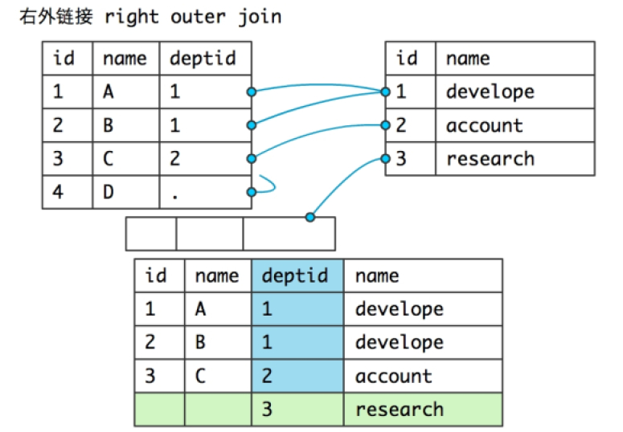

# DQL - 基本查询1

表格(table):它是由行(rows)和列(column)组成的二维空间
`它是数据库存贮数据的基本单位`,将来我们的数据就是存贮在表中;

**查询的本质:**

1. 要查什么:
2. 去哪里查:

基础语法: 

~~~sql
select 列名,列名,列名... from 表格名;
~~~

**注意:如果查询的是表格中所有的列,则可以用*号代替(企业中一般不允许使用)**

**可以使用desc 表名来查询表结构**

## 练习

* 找出员工的所有的信息;

  ~~~sql
  mysql>select * from s_emp;
  ~~~

* 从s_emp表中查询出员工的名字,薪水,职位;

  ~~~sql
  mysql>select first_name,salary,title from s_emp;
  ~~~

- 从s_emp表中查出员工的姓氏,名字;

  ~~~sql
  mysql>select last_name,first_name from s_emp;
  ~~~

* 找出本公司的所有的职称(title);

  ~~~sql
  mysql>select title from s_emp;
  ~~~

* **排重关键字: distinct**[写DDL语句的时候,不要出现mysql的关键字]

  ~~~sql
  mysql>select distinct title from s_emp;
  ~~~

* 找出所有员工的姓名、工资、入职日期

  ~~~sql
  mysql>select concat(last_name,' ',first_name),salary,start_date from s_emp;
  ~~~

  **给列取别名,语法:**

  1. 提高列的可读性
  2. 进行多表查询的时候,肯定会出现同名的列.

  ~~~sql
  select 列名 [as] 列别名,列N [as] 列别名N... from 表名;
  mysql>select concat(last_name,' ',first_name) 姓名,salary 工资,start_date 入职日期from s_emp;
  
  mysql>select concat(last_name,' ',first_name) as 姓名,salary as 工资,start_date as 入职日期 from s_emp;
  
  --mysql中是使用单引号作为字符串的包裹的符号.
  --双引号是用来保持一组格式的
  mysql>select concat(last_name,' ',first_name) "姓 名",salary "工 资",start_date "入职日期" from s_emp;
  ~~~

* 找出员工姓名及他的职称

  ~~~sql
  mysql>select concat(last_name,' ',first_name) 姓名,title 职称 from s_emp;
  ~~~

* 找出每个订单的费用、支付方式、出货日期

  ~~~sql
  mysql> select id,total,payment_type,date_ordered from s_ord;
  ~~~

* 找出所有的客户名及他的电话号码

  ~~~sql
  mysql> select id,name,phone from s_customer;
  ~~~

**提示:如果不知道表中的列名,可以再次通过desc 表名来查询表结构进行窥探**

# 基本查询2

* **sql具有运算的能力**

  比如:从员工表中查询出员工名字和他的年薪[不考虑提成]

  ~~~sql
  mysql>select id,first_name,salary*12 年薪 from s_emp;
  ~~~

  

* **sql具有字符串拼接能力并且可以给列取名**

  * 利用**concat(str1,str2,str3...)函数**来进行拼接

  * 列取别名语法:SELECT 列1 [as] 列别名1,列2 [as] 列别名2 from TABLE_NAME
  * 注意as或者AS关键字是可以省略不写的,我们也可以用单引号或者双引号来对别名内容进行"包裹"

~~~
coalesce(m,n) -> m为null结果都是n,否则是m
SELECT COALESCE('',0)　　　　结果''  
SELECT COALESCE('    ',0)　　 结果''  
SELECT COALESCE(null,0)　　  结果0  
SELECT COALESCE(123,0)       结果123  

IFNULL(m,n) - m==null?n:m
SELECT IFNULL('',0)　　　　　  结果''  
SELECT IFNULL(null,0)　　　　 结果0  
SELECT IFNULL(123,0)　　　　结果123 
~~~
* **空值置换函数**

  * 查询所有员工的名字,年薪(考虑提成)

    ~~~sql
    mysql>select id,first_name,salary*(1+IFNULL(commission_pct,0)/100)*12 "年薪(提成)" from s_emp;
    ~~~

  * **注意:null和所有的值进行运算最后都为null;**

  * coalesce(m,n)相当于m==null?m:n

# 条件查询

where字句用来过滤查询的数据,**它对字面量大小写是敏感的**

出现在where后面的运算符有:

1. **比较运算符**

   ~~~sql
   "="相等返回1，不等返回0，空值不能使用等号和不等号判断
   "<>"不等于
   "!="不等于
   "<=>"与=作用相等，唯一区别是它可以用来判断空值。
   “>”用来判断左边的操作数是否大于右边的操作数。如果大于，返回1.如果不大于，返回0。空值不能用“>”来判断。
   “>=”用来判断左边的操作数是否大于等于右边的操作数。如果大于等于，返回1.如果小于，返回0。空值不能用“>=”来判断。
   “<”用来判断左边的操作数是否小于右边的操作数。如果小于，返回1.如果不小于，返回0。空值不能用“<”来判断。
   <=”用来判断左边的操作数是否小于等于右边的操作数。如果小于等于，返回1.如果大于，返回0。空值不能用“<=”来判断。
   “is null”用来判断操作数是否为空值。为空时返回1，不为空返回0。
   "is not null"与上面相反
   “between m and n”可以判断操作数是否落在某个取值范围内- [m,n]
   “in”可以判断操作数是否落在某个集合中。表达式“x1 in(值1，值2，…,值n) - 是or的关系.
   "not in" - 是否不在某个集合中
   ”,如果x1等于其中任何一个值，返回1，不是返回0。
   “like”用来匹配字符串。表达式“x1 like s1”,如果x1与字符串s1匹配，结果返回1。
   “regexp”也用来匹配字符串，但其中使用正则表达式匹配。
   ~~~

2. **逻辑运算符**

都是属于短路的.

~~~
and:当所有条件都成立时,返回1,否则返回0
or:只要存在一个条件成立时,返回1,否则返回0
~~~

# 模糊匹配

## regexp和like的区别

* regexp

  ~~~sql
  --只要first_name中出现了'en',那么就会匹配成功,这个时候en是作为一个整体
  mysql>select first_name from s_emp where first_name regexp 'en';
  
  --如果将字符串放入到[]中,那么会拆分成每个字符,只要first_name中出现其中任意一个字符串,就会匹配成功
  mysql>select first_name from s_emp where first_name regexp '[en]';
  
  --查找以n或者N字符结尾的first_name
  mysql>select first_name from s_emp where first_name regexp 'n$';
  
  --找出以t或者T开头的fist_name
  mysql>select first_name from s_emp where first_name regexp '^t';
  
  --查询first_name中不包含'en'的记录
  mysql>select first_name from s_emp where first_name not regexp 'en';
  
  mysql>select first_name from s_emp where first_name regexp 'e?';//+ * 
  
  --查询热卖或者推荐过着畅销的图书信息
  --找出first_name中包含en或者an的.
  --忽略大小写 - 英文
  mysql>select first_name from s_emp where first_name regexp '热卖|畅销';
  ~~~

* like - 忽略大小写的

  ~~~sql
  mysql>select first_name from s_emp where first_name like 'en';//查不出任何的结果
  --精确匹配
  mysql>select first_name from s_emp where first_name like '热卖';
  
  --查询first_name中以'M'开头的
  mysql>select first_name from s_emp where first_name like 'M%';
  
  --找出first_name中以'n'结尾的
  mysql>select first_name from s_emp where first_name like '%n';
  
  --找出first_name中包含'en'的
  mysql>select first_name from s_emp where first_name like '%en%';
  
  等同于
  mysql>select first_name from s_emp where first_name regexp 'en';//不区分大小写而已
  
  --找出first_name中不包含'en'的
  mysql>select first_name from s_emp where first_name not like '%en%';
  
  --比如找出第三个字符是'a'的first_name
  mysql>select first_name from s_emp where first_name like '__a%';
  
  --first_name中正好就存在%字符
  --需求:找出first_name中包含%的信息
  mysql>select first_name from s_emp where first_name like '%\%%'
  mysql>select first_name from s_emp where first_name like '%/%%' escape '/';
  ~~~

  

**模糊匹配:like**

通配符:

1.  _ 通配任意单个字符

2.  % 通**配任意多个字符**

注意:如果查询结果中本身就含有_或者%特殊字符,就必须进行转译,
	 转译符通过关键字escape定义.

	 select first_name from s_emp 
	 where first_name like '%/_%' escape '/';

## 条件查询练习

1. 查出在41部门的员工名字,工资

   ~~~sql
   mysql>select first_name,salary,dept_id from s_emp where dept_id = 41;
   ~~~

2. 查出工资高于1500的员工的信息

   ~~~sql
   mysql>select * from s_emp where salary>1500;
   ~~~

3. 找出工资大于1200元的员工全名、工资、职称

   ~~~sql
   mysql>select concat(last_name,' ',first_name) 姓名,salary 工资,title 职称 from s_emp
   where salary>1200;
   ~~~

4. 查出在41,42,50部门的员工名,薪水

   ~~~sql>
   --推荐方式
   mysql>select dept_id,first_name,salary from s_emp where dept_id = 41 or dept_id = 42 or dept_id = 50;
   
   --等同于
   
   mysql>select dept_id,first_name,salary from s_emp where dept_id in(41,42,50);
   ~~~

5. 找出工资在1200到1500之间的员工名.

   ~~~sql
   mysql>select id,first_name,salary from s_emp where salary between 1200 and 1500;
   ~~~

6. 找出工资大于1500并且没有提成的员工

   ~~~sql
   mysql>select first_name,salary,commission_pct from s_emp where salary>1500 and commission_pct is null;
   ~~~

7. 查出名字是以M打头的员工

   ~~~sql
   mysql>select * from s_emp where first_name like 'M%';
   mysql>select * from s_emp where first_name regexp '^M';//m或者M
   ~~~

8. 查出姓名中第三个字母是e的员工

   ~~~sql
   mysql>select * from s_emp where first_name like '__e%';
   ~~~

   

9. 找出没有提成率的员工

   ~~~sql
   mysql>select * from s_emp where commission_pct is null;
   mysql>select * from s_emp where commission_pct <=> null;
   ~~~

10. 找出有提成率的员工

    ~~~sql
    mysql>select * from s_emp where commission_pct is not null;
    ~~~

11. 找出费用超过10000元的订单编号及支付方式

    ~~~sql
    mysql>select id,payment_type,total from s_ord where total>10000;
    ~~~

12. 找出工资在950(含)至1200(含)元的员工姓名、职称

    ~~~sql>
    mysql>select first_name,title,salary from s_emp where salary between 950 and 1200;
    mysql>select first_name,title,salary from s_emp where salary>=950 and salary<=1200;
    ~~~

13. 找出名字中含有字母a的员工

    ~~~sql
    mysql>select first_name from s_emp where first_name like '%a%';
    ~~~

14. 找出2月份入职的员工名、入职时间、工资 - 假的

    ~~~sql
    mysql>select first_name,start_date,salary from s_emp where start_date like '%-02-%';
    ~~~

    

# 排序语句

尽量慎重order by语句,性能比较低 - 如何解决? - 数据库优化.

**语法:**
**order by 列名** asc(升序,默认可不写) | desc (降序)

默认的是升序.

**目前为止SQL语句语法:**
SELECT 列1,列2,... FROM 表名
[WHERE 条件语句]
[ORDER BY 排序语句]

## 练习

1. 查询出职称是Stock Clerk的员工全名、工资，并按工资的降序排序

    ~~~sql
    --根据工资升序
    mysql>select concat(last_name,' ',first_name) 姓名,salary,title from s_emp where title = 'Stock Clerk' order by salary;
    
    --查询的时候,遇到desc性能会更低
    --order by + 列名
    mysql>select concat(last_name,' ',first_name) 姓名,salary 工资,title from s_emp where title = 'Stock Clerk' order by salary desc;
    
    --order by + 列别名
    mysql>select concat(last_name,' ',first_name) 姓名,salary 工资,title from s_emp where title = 'Stock Clerk' order by 工资 desc;
    
    --order by + 列的序号
    --mysql中的索引位置,序号都是从1开始
    --推荐使用的方式
    mysql>select concat(last_name,' ',first_name) 姓名,salary 工资,title from s_emp where title = 'Stock Clerk' order by 2 desc;
    ~~~

2. 查询出职称中带VP的员工名字,工资,并按工资的降序排序

    ~~~sql
    mysql>select first_name,title,salary from s_emp where title like '%VP%' order by 3 desc;
    ~~~

3. 查询出职称中带VP的员工名字,工资,并按工资的降序排序,如果工资相同,则继续按照first_name升序排.

   ~~~sql
   mysql>select first_name,title,salary from s_emp where title like '%VP%' order by 3 desc,1 asc;
   ~~~

4. 查询出年薪低于25000的员工名,职称,并按年薪升序排序

   ~~~sql
   mysql>select first_name,salary*12*(1+IFNULL(commission_pct,0)/100) 年薪 from s_emp
   where salary*12*(1+IFNULL(commission_pct,0)/100)<25000 order by 2 asc;
   ~~~

**注意:排序字句中可以使用列号进行排序,也可以使用列名或者别名进行排序.**

# mysql函数
## 字符串函数

此处仅仅是列举常用的

1. ascii(str) - 返回字符串str的第一个字符的ascii值(str是空串时返回0)
2. **concat(str1,str2,...) - 把参数连成一个长字符串并返回(任何参数是null时返回null)**  
3. **length(str)  - 返回字符串的长度,一个汉字是算三个字符[utf-8]，一个数字或字母算一个字符**。
4. **char_length(str) -  不管汉字还是数字或者是字母都算是一个字符。 - 相当于corejava中的字符串的length()**
5. locate(substr,str) - 返回字符串substr在字符串str第一次出现的位置(str不包含substr时返回0)  
6. locate(substr,str,pos) - 返回字符串substr在字符串str的第pos个位置起第一次出现的位置(str不包含substr时返回0)  
7. **instr(str,substr) - 返回字符串substr在字符串str第一次出现的位置(str不包含substr时返回0)**  
8. lpad(str,len,padstr) - 用字符串padstr填补str左端直到字串长度为len并返回  
9. **rpad(str,len,padstr) - 用字符串padstr填补str右端直到字串长度为len并返回**
10. left(str,len) - 返回字符串str的左端len个字符
11. right(str,len) - 返回字符串str的右端len个字符
12. **substring(str,pos,len) - 返回字符串str的位置pos起len个字符**  
13. **substring(str,pos) - 返回字符串str的位置pos起的一个子串**
14. ltrim(str) - 返回删除了左空格的字符串str  
15. rtrim(str)  - 返回删除了右空格的字符串str  
16. space(n) - 返回由n个空格字符组成的一个字符串  
17. replace(str,from_str,to_str)  - 用字符串to_str替换字符串str中的子串from_str并返回 
18. reverse(str) - 颠倒字符串str的字符顺序并返回
19. insert(str,pos,len,newstr) - 把字符串str由位置pos起len个字符长的子串替换为字符串
20. lower(str) - 返回小写的字符串str  
21. upper(str) - 返回大写的字符串str
22. **substring_index(str,delimiter,count) -  如果count是正数，那么就是从左往右数，第count个分隔符的左边的全部内容**

## 数字函数

1. abs(n) - 求绝对值

2. mod(n,m) - 取模运算,返回n被m除的余数(同%操作符)

3. **floor(n) - 返回不大于n的最大整数值**  

4. **ceiling(n) - 返回不小于n的最小整数值**  

5. **round(n[,d]) - 返回n的四舍五入值,保留d位小数(d的默认值为0)**

6. pow(x,y) - 返回值x的y次幂  

7. sqrt(n) - 返回非负数n的平方根

8. pi() - 返回圆周率  

9. rand() - 返回在范围0到1.0内的随机浮点值

10. **truncate(n,d) - 保留数字n的d位小数并返回 ,如果d是0,直接保留整数位,并没有四舍五入.**

## 日期时间函数

1. dayofweek(date) - 返回日期date是星期几(1=星期天,2=星期一,……7=星期六,odbc标准)  
2. weekday(date) - 返回日期date是星期几(0=星期一,1=星期二,……6= 星期天)
3. year(date) - 返回date的年份(范围在1000到9999)    
4. month(date)  - 返回date中的月份数值   
5. dayofmonth(date) - 返回date是一月中的第几日(在1到31范围内)   
6. hour(time) - 返回time的小时数(范围是0到23)  
7. minute(time) - 返回time的分钟数(范围是0到59) 
8. second(time) - 返回time的秒数(范围是0到59) 
9. curdate() - 以'yyyy-mm-dd'或yyyymmdd格式返回当前日期值(根据返回值所处上下文是字符串或数字) 
10. curtime() - 以'hh:mm:ss'或hhmmss格式返回当前时间值(根据返回值所处上下文是字符串或数字)
11. **now() - 以'yyyy-mm-dd hh:mm:ss'或yyyymmddhhmmss格式返回当前日期时间(根据返回值所处上下文是字符串或数字)**     
12. **last_day(date) - date日期所在月的最后一天是什么时候**
13. current_timestamp, current_timestamp() - 获得当前时间戳函数
14. **datediff(d1,d2) - 两个日期d1,d2之间相差的天数**
15. from_unixtime(time-stamp) - 日期转时间戳

### TimeSTAMPDIFF函数

语法:timestampdiff(type,date1,date2);//返回俩个日期相差的type.date2 - date1

### 其他

~~~sql
date_add(date,interval expr type)  
date_sub(date,interval expr type)    
adddate(date,interval expr type)    
subdate(date,interval expr type)  
对日期时间进行加减法运算  
(adddate()和subdate()是date_add()和date_sub()的同义词,也
可以用运算符+和-而不是函数  
date是一个datetime或date值,expr对date进行加减法的一个表
达式字符串type指明表达式expr应该如何被解释  
[type值 含义 期望的expr格式]:  
　second 秒 seconds    
　minute 分钟 minutes    
　hour 时间 hours    
　day 天 days    
　month 月 months    
　year 年 years    
　minute_second 分钟和秒 "minutes:seconds"    
　hour_minute 小时和分钟 "hours:minutes"    
　day_hour 天和小时 "days hours"    
　year_month 年和月 "years-months"    
　hour_second 小时, 分钟， "hours:minutes:seconds"    
　day_minute 天, 小时, 分钟 "days hours:minutes"    
　day_second 天, 小时, 分钟, 秒 "days
hours:minutes:seconds" 
　expr中允许任何标点做分隔符,如果所有是date值时结果是一个
date值,否则结果是一个datetime值)  
　如果type关键词不完整,则mysql从右端取值,day_second因为缺
少小时分钟等于minute_second)  
　如果增加month、year_month或year,天数大于结果月份的最大天
数则使用最大天数)    
~~~

~~~sql
select date_add(now(),interval 1 day);
~~~

### 日期格式化

date_format(date,format)    

~~~
根据format字符串格式化date值  
　(在format字符串中可用标志符:  
　%m 月名字(january……december)    
　%w 星期名字(sunday……saturday)    
　%d 有英语前缀的月份的日期(1st, 2nd, 3rd, 等等。）    
　%Y 年, 数字, 4 位    
　%y 年, 数字, 2 位    
　%a 缩写的星期名字(sun……sat)    
　%d 月份中的天数, 数字(00……31)    
　%e 月份中的天数, 数字(0……31)    
　%m 月, 数字(01……12)    
　%c 月, 数字(1……12)    
　%b 缩写的月份名字(jan……dec)    
　%j 一年中的天数(001……366)    
　%h 小时(00……23)    
　%k 小时(0……23)    
　%h 小时(01……12)    
　%i 小时(01……12)    
　%l 小时(1……12)    
　%i 分钟, 数字(00……59)    
　%r 时间,12 小时(hh:mm:ss [ap]m)    
　%t 时间,24 小时(hh:mm:ss)    
　%s 秒(00……59)    
　%p am或pm    
　%w 一个星期中的天数(0=sunday ……6=saturday ）    
　%u 星期(0……52), 这里星期天是星期的第一天    
　%u 星期(0……52), 这里星期一是星期的第一天    
　%% 字符% )  
~~~

## 转换函数

* 字符串与数字之间转换

~~~
字符串转换成数字
方法一：SELECT CAST('123' AS SIGNED);
方法二：SELECT '123'+0;//亲测有效
方法三：SELECT CONVERT('123',SIGNED);//SIGNED代表是有符号的数字 - 正数或者负数
=======
数字转换成字符串
使用concat函数
~~~

* 字符串与日期之间转换

~~~
日期转换成字符串使用date_format函数
字符串转换成日期str_to_date(str,format)；注:format格式必须和str的格式相同，否则返回空
~~~

## 练习

1. 查出客户表(s_customer)中phone列最后一个-线后面的部分

   ~~~sql
   mysql>select phone,substring_index(phone,'-',-1) "phone_suffix" from s_customer;
   ~~~

2. 模拟向银行中只显示姓名的第一个字符(奥巴马变成奥**)

   ~~~sql
   mysql>select first_name,concat(substring(first_name,1,1),rpad('*',char_length(first_name)-1,'*')) 模糊姓名 from s_emp;
   
   mysql>select first_name,replace(first_name,substring(first_name,2),rpad('*',char_length(first_name)-1,'*')) 模糊姓名 from s_emp;
   ~~~

3. 找出名字长度超过5的员工

   ~~~sql
   mysql>select first_name from s_emp where char_length(first_name) >= 5;
   
   --如果给first_name列加了索引
   --导致索引失效的
   mysql>select first_name from s_emp where char_length(first_name)-5>=0;
   ~~~

4. 找出员工的工作月数

   ~~~sql
   mysql>select first_name,timestampdiff(month,start_date,now()) "工作月数" from s_emp;
   ~~~

5. 查询员工的工作天数

   ~~~sql
   mysql>select first_name,timestampdiff(day,start_date,now()) "工作天数" from s_emp;
   
   mysql>select first_name,datediff(now(),start_date) "工作天数" from s_emp;
   ~~~

6. 计算一年前,当前,一年后的时间

   ~~~sql
   mysql>select date_add(now(),interval -12 month) 一年前,now() 现在,date_add(now(),interval 1 year) 一年后;
   ~~~

7. 当前日期前六个月的最后一天

   ~~~sql
   mysql>select last_day(date_add(now(),interval -6 month)) "lastday";
   ~~~

8. 把员工的入职日期格式化为年/月/日

   ~~~sql
   mysql>select first_name,date_format(start_date,'%Y/%m/%d') 入职日期 from s_emp;
   
   --xxxx年xx月xx日
   mysql>select first_name,date_format(start_date,'%Y年%m月%d日') 入职日期 from s_emp;
   
   mysql>select first_name,concat(year(start_date),'年',month(start_date),'月',day(start_date),'日')
   入职日期 from s_emp;
   ~~~

9. 找出5月份入职的员工

   ~~~sql
   mysql>select first_name,start_date from s_emp where month(start_date) = 5;
   
   mysql>select first_name,start_date from s_emp where date_format(start_date,'%m') = '05';
   ~~~

   

# 高级查询

**关联查询 - 作用:可以跨多表查**

查询出员工的名字和他所在部门的名字**(错误)**

~~~sql
mysql>select first_name,name from s_emp,s_dept;
~~~

**错误原因:**

以上写法会出现**笛卡尔积**,产生很多冗余错误的数据,如果要

`排除笛卡尔积`,则应该使用where字句进行条件的过滤.

**正确写法:传统方式**

~~~sql
mysql>select first_name,name from s_emp,s_dept where s_emp.dept_id = s_dept.id;
~~~

----给`表格取别名`,可以简化SQL语句,还可以区别不同的列

~~~sql
mysql>select e.first_name,d.name from s_emp e,s_dept d where e.dept_id = d.id;
~~~

 **正确写法:join方式**

用法:出现在join左右两边的表一定存在关系.并且使用on关键字来进行筛选

on 多的一方的外键 = 一的一方的主键

~~~sql
mysql>select e.first_name,d.name from s_emp e join s_dept d on e.dept_id = d.id;
~~~

**练习**

* 查询出部门名以及它所在的区域名称

* 查询出'Sales'部门的所有员工的名字和工资

  ~~~sql
  mysql>
  ~~~

* 查询出设在Asia的部门名

  ~~~sql
  
  ~~~

* 查询出名字叫Unisports的客户订单的信息

* 查询出设在Asia工作的员工名,工资,职称

  s_region区域表和s_emp表没有直接的关系.但是它们都和s_dept部门表存在关系.

  一个区域拥有多个部门,一个部门拥有多个员工.

  ~~~sql
  mysql>select r.name,e.first_name,e.salary,e.title from s_emp e 
  join s_dept d on e.dept_id = d.id
  join s_region r on r.id = d.region_id where r.name = 'Asia';
  
  --传统的写法
  mysql>select r.name,e.first_name,e.salary,e.title from s_emp e
  ,s_dept d,s_region r where e.dept_id = d.id and d.region_id = r.id
  and r.name = 'Asia';
  ~~~

* 查询出客户名及它的订单号,总费用

  * 内联:

    join左边的表中的记录如果在右边的表中不存在.那么则不会被查询出来.

    只会查询出有订单的客户信息,没有订单的则不会被查询出来.

    ~~~sql
    mysql>select c.id,c.name,o.id,o.total from s_customer c join s_ord o 
    on c.id = o.customer_id;
    ~~~

  * 左外联

    没有订单的客户也会被查询出来.

    join左边的表 - 基准表.右边的表 - 非基准表

    非基准表中没有基准表中对应的记录的时候,基准表中的记录仍然会被显示.

    ~~~sql
    mysql>select c.id,c.name,o.id,o.total from s_customer c left join s_ord o 
    on c.id = o.customer_id;
    ~~~

  * 右外联

    ~~~sql
    mysql>select c.id,c.name,o.id,o.total from s_ord o right join s_customer c on c.id = o.customer_id;
    ~~~

    

## 关联查询分类

1. `内联查询` - [inner] join

2. `外联查询` -  

    2-1. **左外联**:以关联点(join)左边的表为基准,非基准表中没有数据与
                        基准表中匹配,则基准表中的行记录还是会被显示.

    ​		     left [outer] join

    2-2. **右外联**:以关联点(join)右边的表为基准,非基准表中没有数据与
                        基准表中匹配,则基准表中的行记录还是会被显示.

       		    right [outer] join

    2-3. **全外联**:full [outer] join
           		    **mysql中不支持**

    2-4. **交叉联**:返回连接两张表格的笛卡尔积 
                          cross join

3. `图示一:内联
     

4. `图示二:全外连接`
     

5. `图示三:右外连接`
     

6. `图示四:左外连接`
     

## 自关联

自关联查询:同一张表自己关联自己

**找出员工名以及他的上司名**

~~~sql
mysql>select e1.first_name "员工名",e2.first_name "上司名" from s_emp e1 left join s_emp e2 on e2.id = e1.manager_id;
~~~

## 关联查询练习

* 查询出在'Asia'工作的员工

  ~~~sql
  mysql>select r.name,e.first_name from s_emp e join s_dept d on e.dept_id = d.id
  join s_region r on r.id = d.region_id where r.name = 'Asia';
  ~~~

* 找出Womansport所购买的订单信息(订单编号,费用,支付方式)

  ~~~sql
  mysql>select c.name,o.id,o.total,o.payment_type from s_customer c join s_ord o
  on c.id = o.customer_id where c.name = 'Womansport';
  ~~~

* 找出Operations部门工作的员工名,工资,并且按照工资降序排列

  ~~~sql
  mysql>select e.first_name,e.salary,d.name from s_emp e join s_dept d on e.dept_id = d.id where d.name = 'Operations' order by 2 desc;
  ~~~

  

## 关联查询和Java

~~~java
public class Emp{
    //其余属性...
    
    private Region region;
    
    //多个员工对应一个部门
    private Dept dept;
}

public interface IDeptDao{
    Dept getById(int id);//单表查询
}

public interface IEmpDao{
    
    //根据员工的id来查询员工信息
    //业务需求 - 并且查询出该员工的部门名称
    Emp getById(int id);
    
}

public class EmpService{
    //伪代码
    Emp e = dao.getById(1);//单表查询... - dept_id
    //e.setName(name);
    //e.setDept(...);
    Dept d = deptDao.getById(e.getDept().getId());
    e.setDept(d);
}

Test.java

~~~

## 分组函数
**定义:利用内置的分组函数来查询**

Mysql数据库中提供了相对应的分组函数来支持分组查询:

1. sum()		求总和,会自动忽略null值

2. count()		求总个数,包含null值和相同值

3. avg()		求平均数,会自动忽略null值

4. max()		求最大值

5. min()		求最小值

注意:**组函数也叫做多行函数**,与**单行函数**不同的是,组函数可以同时处理多行数据.

**分组的语法:**

**注意点:select语句中如果出现了普通列,那么普通列一定也要出现在group by后面.**

~~~java
select 列名 [列别名],组函数(列名) from 表名 
where 字句[正常的条件筛选]
group by 列名
having 字句[只能是组函数的判断条件];
~~~

* 查询出全公司的最高工资,最低工资,平均工资和工资总和

  ~~~sql
  mysql>select max(salary),min(salary),avg(salary),sum(salary) from s_emp;
  ~~~

* 查询出各个部门的最高工资,最低工资,平均工资和工资总和

  ~~~sql
  mysql>select dept_id,max(salary),min(salary),avg(salary),sum(salary) from s_emp
  group by dept_id;
  ~~~

## 分组查询练习

* 查询出各个部门的名称,最低工资,平均工资和工资总和

  ~~~sql
  mysql>select d.id,d.name,min(salary),avg(salary),sum(salary) from s_emp e
  join s_dept d on d.id = e.dept_id group by d.id,d.name;
  ~~~

* 查询出查询平均工资高于1300的各个部门的名称,平均工资.

  ~~~sql
  mysql>select d.id,d.name,avg(salary) from s_emp e join s_dept d on d.id = e.dept_id
  group by d.id,d.name having avg(salary)>1300;
  ~~~

* 查询出各个区域名和设在此区域的部门数量

  ~~~sql
  mysql>select r.id,r.name,count(*) from s_dept d join s_region r on r.id = d.region_id group by r.id,r.name;
  
  mysql>select r.id,r.name,count(d.id) from s_dept d join s_region r on r.id = d.region_id group by r.id,r.name;
  ~~~

* 查询出客户名及客户的订单数

  ~~~java
  mysql>select c.id,c.name,count(o.id) from s_customer c left join s_ord o on o.customer_id = c.id group by c.id,c.name;
  ~~~

* 查询出订单数超过一个的客户

  ~~~sql
  mysql>select c.id,c.name,count(o.id) from s_customer c left join s_ord o on o.customer_id = c.id group by c.id,c.name having count(o.id)>1;
  ~~~

* 查询出平均工资超过1300的部门编号

  ~~~sql
  mysql>select dept_id,avg(salary) from s_emp group by dept_id having avg(salary)>1300;
  ~~~

* 查询出平均工资超过1300的部门名字

  ~~~sql
  mysql>select d.id,d.name,avg(e.salary) from s_emp e join s_dept d on d.id = e.dept_id group by d.id,d.name having avg(salary)>1300;
  ~~~

* 统计本公司的员工数

  ~~~sql
  mysql>select count(e.id) from s_emp e;
  ~~~

* 统计本公司的职称个数

  ~~~sql
  mysql>select count(distinct title) from s_emp;
  ~~~

* 统计各个部门的员工数,按照员工数降序排列

  ~~~sql
  mysql>select dept_id,count(id) from s_emp group by dept_id order by 2 desc; 
  ~~~

* 查询出各个区域及本区域工作的员工数,并且按照员工数降序排列

  ~~~sql
  mysql>select r.id,r.name,count(e.id) from s_region r join s_dept d on d.region_id = r.id join s_emp e on d.id = e.dept_id group by r.id,r.name order by 3 desc; 
  ~~~

* 查询出各职称的员工数量

  ~~~sql
  mysql>select title,count(id) from s_emp group by title;
  ~~~

* 查询出工资超过1200的各部门员工数量

  ~~~sql
  mysql>select dept_id,count(e.id) from s_emp e where salary>1200 group by dept_id;
  ~~~

* 查询出工资超过1200的各部门员工数量超过1的.

  ~~~sql
  mysql>select dept_id,count(e.id) from s_emp e where salary>1200 group by dept_id
  having count(e.id)>1;
  ~~~

* 查询出人数超过3个员工的部门编号和部门名称

  ~~~sql
  mysql>select d.id,d.name,count(e.id) from s_emp e join s_dept d on d.id = e.dept_id
  group by d.id,d.name having count(e.id)>3;
  ~~~

**where和having的差别**

1. where是条件过滤,是在分组之前的过滤,不能使用组函数.
2. having是在分组之后的进一步过滤,可以使用组函数.

# 子查询

## 定义

查询中嵌套查询就是子查询

注意:**子查询必须用()括起来**

## 子查询的本质

a. 内联视图 - 将子查询的结果看作是一张表.

    ~~~sql
create table t_cp(select * from s_emp);

or

create table t_cp2
as
select * from s_emp;
    ~~~

b. 把子查询的结果作为外部查询的条件

### 子查询分解

**找出工资大于Mark的员工名字和工资**

1. 查询出Mark的工资是多少

   ~~~sql
   mysql>select salary from s_emp where first_name = 'Mark';//1450
   ~~~

2. 查询出高于1450工资的人

   ~~~sql
   mysql>select first_name,salary from s_emp where salary>1450;
   ~~~

3. **整合成子查询**

   ~~~sql
   mysql>select first_name,salary from s_emp where salary>(select salary from s_emp where first_name = 'Mark');
   ~~~

## 子查询的分类

**1.无关子查询:**

   内查询没有用到外查询的列,而且内查询可以单独运行 - 性能比相关子查询高.

**2.相关子查询:**

   内查询使用了外查询的列,而且内查询不能单独运行.

## 子查询的特点

1. 子查询很灵活,可以解决很多其他查询方式不能解决的问题

2. 子查询效率很低,其中相关子查询效率最低

3. 子查询嵌套的层数越多,则效率越低

**为什么相关子查询的效率极其低下?**

内查询用到了外查询的列,每次查询行记录时都会迭代表格中

每一行的行记录,而这种迭代中产生的值都是动态生成的.

**结论:**

性能排序/优先使用

**关联/分组查询>无关子查询>相关子查询**

* 找出各个部门中大于他所在部门平均工资的员工名和工资

  ~~~sql
  mysql>select e.dept_id,e.first_name,e.salary from s_emp e where e.salary>(select avg(e1.salary) from s_emp e1 where e.dept_id = e1.dept_id);
  
  
  外层 select -> 外层for     -> 外层循环走一次,内层循环走全部
  	内层select - > 内层for
  ~~~

* 查看客户的id,姓名和它的订单数量.

  * 分组查询

    ~~~sql
    mysql>select c.id,c.name,count(o.id) from s_customer c left join s_ord o
    on o.customer_id = c.id group by c.id;
    ~~~

  * 无关子查询 - 将查询的结果视作一张表

    * 分解 - 查询c.id,c.name  -> m表

      ~~~sql
      mysql>select c.id,c.name from s_customer c;
      ~~~

    * 分解 - 查询订单数量 - s_ord ->n表

      ~~~sql
      mysql>select o.customer_id,count(o.id) count_ from s_ord o group by o.customer_id;
      ~~~

    * 分解 - 操作假的S1表和S2表

      ~~~sql
      mysql>select m.*,n.count_ from (select c.id,c.name from s_customer c) m
      left join (select o.customer_id,count(o.id) count_ from s_ord o group by o.customer_id) n on m.id = n.customer_id;
      ~~~

      

  * 相关子查询 - 性能最差的 - 子查询可以出现在select 列中

    ~~~sql
    mysql>select c.id,c.name,(select count(o.id) from s_ord o where c.id = o.customer_id) 订单数量 from s_customer c;
    ~~~

## 子查询练习

- 找出平均工资大于公司平均工资的部门编号

  ~~~sql
  mysql>select dept_id,avg(salary) from s_emp group by dept_id having avg(salary)>(select avg(salary) from s_emp);
  ~~~

-  找出与'Ben'同部门的员工

  ~~~3sql
  mysql>select e1.dept_id,e1.first_name from s_emp e1 where e1.dept_id = (
  	select e2.dept_id from s_emp e2 where e2.first_name = 'Ben'
  ) and e1.first_name<>'Ben';
  ~~~

## exists和not exists

exists只关心是否能够查询到结果,如果能够查询到结果,则返回true.否则返回false.

* 找出各个部门中工资排前二的.

  换个思路:当前部门中比"我"[当前部门]工资高的人不超过1个.

  ~~~sql
  mysql>select e1.dept_id,e1.first_name,e1.salary from s_emp e1
  where exists(
  	select 1 from s_emp e2 where e1.dept_id = e2.dept_id
      and e2.salary>e1.salary having count(*)<=1
  ) order by 1 desc;
  
  mysql>select e1.dept_id,e1.first_name,e1.salary from s_emp e1
  where not exists(
  	select 1 from s_emp e2 where e1.dept_id = e2.dept_id
      and e2.salary<e1.salary having count(*)>1
  ) order by 1 desc;
  ~~~

# 运算符

* MYSQL中不支持差集合交集

  差

  ~~~sql
  mysql>select a_.id from (select id from s_emp where id < 5) a_
  where a_.id not in (select id from s_emp where id <3);
  
  mysql>select a_.id from (select id from s_emp where id <3) a_
  where a_.id not in (select id from s_emp where id < 5);
  ~~~

* union求并集

  ~~~sql
  mysql>select id from s_emp where id < 5
  	 union
  	 select id from s_emp where id < 3;
  ~~~

* union all

  ~~~sql
  select id from s_emp where id < 5
  union all
  select id from s_emp where id < 3;
  ~~~

## 差集和Exists集合使用的场景

* 求购买的商品包含了顾客"Dennis"所购买的所有商品的顾客（姓名）

  --拿Dennis的productid - c这个客户购买的productid - 如果为空 - 是想要的

  --not exists(如果没有查询到任何结果) -> 整个返回true

  --exists(如果没有查询到任何结果) - > 整个返回false

  ~~~sql
  msyql>select c.customerid,c.name from customer c where not exists(
      select 1 from
  	(select p1.productid from purcase p1 where p1.customerid in (select customerid 		 from customer where name = 'Dennis')) dn_ where dn_.productid not in(
      	select p2.productid from purcase p2 where p2.customerid = c.customerid
          and c.name<>'Dennis'
      )
  );
  
  ~~~

* 求购买的商品和顾客"Dennis"所购买的商品一模一样

  ~~~sql
  mysql>select p4.customerid pid,count(p4.productid) count_ from purcase p4 group by p4.customerid;
  
  
  mysql>select a_.customerid,a_.name,b_.count_ from(
  	select c.customerid,c.name from customer c where not exists(
      select 1 from
  	(select p1.productid from purcase p1 where p1.customerid in (select customerid 		 from customer where name = 'Dennis')) dn_ where dn_.productid not in(
      	select p2.productid from purcase p2 where p2.customerid = c.customerid
          and c.name<>'Dennis'
      )
  	)	
  ) a_ join(select p4.customerid pid,count(p4.productid) count_ from purcase p4 group by p4.customerid) b_ on a_.customerid = b_.pid where b_.count_ = (
  	select (select count(p5.productid) from purcase p5 where c3.customerid = p5.customerid) from customer c3 where c3.name = 'Dennis'
  );
  ~~~

  

* 求选了的课程包含了学生"tom"所选的课程的所有的学生.